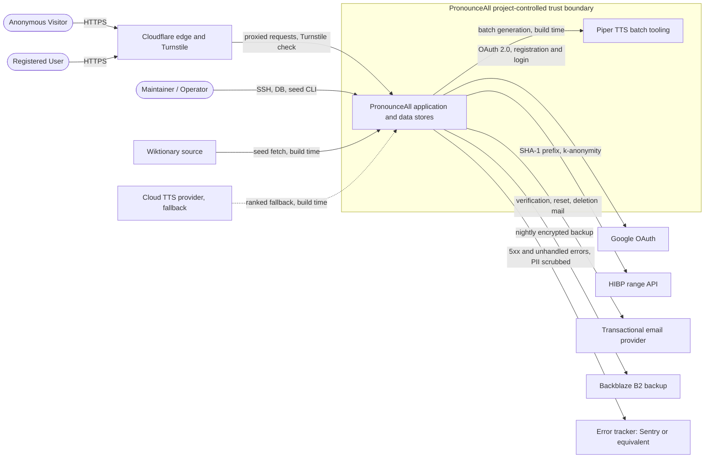
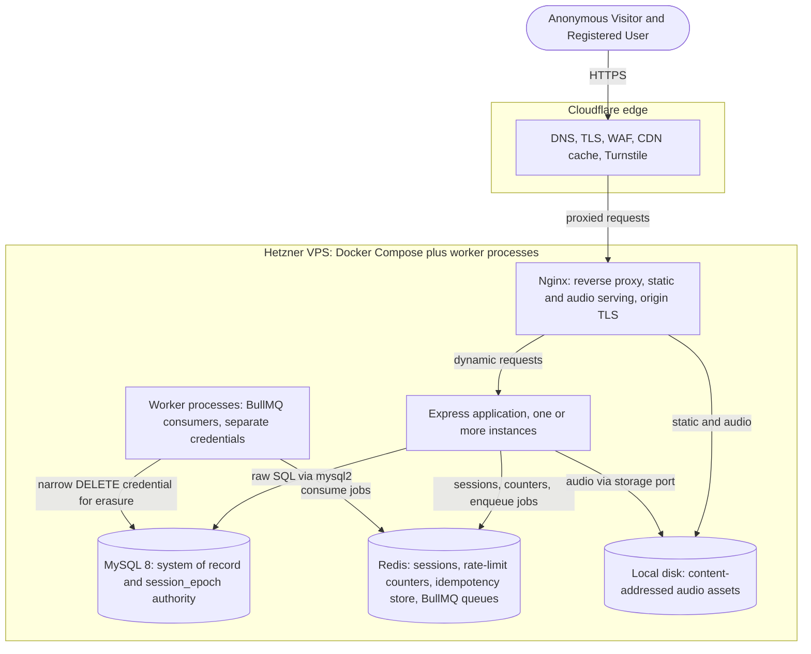

# PronounceAll — Software Design Document (SDD)

**Status: Round 2 working draft. Sections 1, 2, and 3 are complete and reviewed. Sections 6 (cross cutting design) and 7 (directory structure and coding conventions) are pending and complete Round 2. Sections 4 (data model) and 5 (the six key flows) are Round 3.**

This file is assembled from the reviewed Round 2 inline deliverables. It assumes two SRS amendments are applied to `PronounceAll_SRS_v1.0.md`: the NFR-PRIV-06 amendment (FIND-02) and the FR-AUTH-01 amendment (FIND-03). Both are recorded with exact find-and-replace text in the session handoff. Section 2.2 and Section 3.4 already reflect those amendments; if either amendment is not applied to the SRS, the corresponding text here must be reconciled.

---

## 1. Introduction and scope

### 1.1 Purpose

This Software Design Document specifies how PronounceAll is built to satisfy SRS v1.0. It translates the requirements into an architecture, a component decomposition, a cross cutting design, a data model, and a set of key flows, at a level sufficient to guide implementation, with the design decisions that remain open resolved in their assigned SDD sections rather than left indefinite. It records each significant design decision with its rationale, and it names what is deferred to the API Specification, the Threat Model, and the other downstream documents so that those do not begin empty.

### 1.2 Readership

The sole maintainer acting as implementer; any future contributor working under `CONTRIBUTING.md`; and a reviewer auditing the design against the requirements and the security posture. The document assumes familiarity with the Charter and SRS v1.0 and does not reintroduce their content.

### 1.3 Relationship to the Charter, the SRS, and the Round 1 decisions

There are two primary baselines. SRS v1.0 owns what the system must do: the functional and non functional requirements and the appendices. The SDD Round 1 Decisions Document (v1.0.3) owns the settled how: the blocking resolutions B1 to B3, the cross cutting conventions C1 to C6, the content and algorithm decisions E1 to E4, and the vendor and infrastructure picks V1 to V8. Four documents are fixed inputs and are not reopened here: the Charter (vision, scope, success criteria, licensing), the amended Project Handoff Document (locked feature brief and iteration order), the Foundational Decisions (security posture, authentication model, anonymous identity, rate limits, deletion model), and the Round 4 Decisions (the sixteen settled values).

Precedence is explicit. For what to build, the SRS governs. For how to build it, the Round 1 decisions govern. Where a design decision changed a requirement, the change is recorded in the SDD Decisions §6 amendment ledger of fourteen items, which is the reconciliation record between the two baselines; the SRS text already reflects every applicable item. This document builds on those decisions and does not relitigate them.

The conflict rule carries over from the documentation router. If a requirement and a design decision disagree and the amendment ledger does not explain the difference, the conflict is reported rather than resolved silently, and no superseded document is used to settle it.

### 1.4 Scope of this document

The full SDD has nine sections, defined in SDD Handoff §3. It is produced in rounds because a single drafting pass cannot carry a document of this size. Round 2, this document, covers Sections 1, 2, 3, 6, and 7: introduction and scope; actors, system boundary, and use cases; architectural overview and component decomposition; cross cutting design; and directory structure and coding conventions. Round 3 covers Section 4 (data model) and Section 5 (the six key flow sequence diagrams). Round 4 is a mechanical merge and citation sweep that adds no new content.

Flag: the round plan in SDD Handoff §4 assigns Sections 1 to 7 across Rounds 2 and 3 but does not assign a drafting round to Section 8 (design decisions register) or Section 9 (deferrals to downstream documents), while Round 4 is defined as mechanical with no new content. Authoring substantive Section 8 or 9 text in Round 4 would violate that rule. Proposed handling, for the maintainer's decision rather than an assumption: accumulate Sections 8 and 9 incrementally across Rounds 2 and 3, so that Section 8 consolidates and references the design decisions as they are approved and Section 9 records each deferral as it is made, with both complete before Round 4. Round 4 then only merges, sweeps citations, and builds the table of contents.

### 1.5 Technology stack

This document points to the authoritative stack rather than restating it. In outline, the runtime is a server rendered EJS application on Node.js and Express, with MySQL accessed through raw SQL and no ORM, Redis for sessions and rate limiting, served behind Nginx and Cloudflare, containerized with Docker and Docker Compose, deployed to a Hetzner VPS with Certbot for TLS and GitHub Actions for continuous integration. The technology baseline is defined jointly by the Charter and SRS constraints (Charter §5, SRS §2.4 and §2.5) and by the applicable Round 1 decisions. The vendor and infrastructure picks V1 to V8 settle the text to speech tool, the Redis deployment shape, the session store, the audio storage and serving path, the transactional email provider, the off site backup target, the region, and the profanity package; and several cross cutting conventions settle technologies as well, for example Flyway for migrations (C3) and BullMQ for background jobs (C6). Those decisions are cited in Section 3 and Section 6 at the points where they bear on the design, and are not reproduced here.

---

## 2. Actors, system boundary, and use cases

### 2.1 Actors

The actor taxonomy follows the authoritative user classes in SRS §2.3: two human primary actors, one operational actor, the external services the system depends on, and an open source contributor class that sits outside the runtime system.

| Actor | Type | Description |
|---|---|---|
| Anonymous Visitor | Human, primary | A visitor without an account, identified only by the strictly necessary UUID cookie (Foundational Decisions §6). Reads every word and phoneme page, saves and tags words and phonemes, runs practice sessions, requests missing words, and sets cookie, ad, and variant preferences, all without registering. Read only if cookies are unavailable. |
| Registered User | Human, primary | An authenticated account holder, a superset of the Anonymous Visitor. Additionally registers and authenticates through the three paths, has anonymous progress merged on login, manages the account, and exercises the Right to Erasure. Identity resolves through the account rather than the anonymous cookie. |
| Maintainer / Operator | Human, operational | Alp K. and any future co maintainers. Full system access over SSH and the database; v1.0 has no in app administrator role and no admin UI (SRS §2.3, FR-CONTENT-07). Works through database queries, the idempotent seed pipeline, batch audio generation, and the Runbook procedures. The SDD Handoff used the legacy label "Administrator" for this actor; the authoritative term is Maintainer / operator. |
| External services | External systems | Six third parties the system depends on (SRS §2.3): Google OAuth, the Cloudflare edge and Turnstile, the transactional email provider, the HIBP range API, Wiktionary, and the text to speech provider. Their trust boundary position and their runtime versus build time role are set out in §2.2. |

SRS §2.3 also lists an Open source contributor class: outside developers filing issues or pull requests through the public GitHub repository. They are a non-runtime stakeholder with no access to the deployed system and no runtime use case, so they are noted here for completeness and are not modeled as a runtime actor, in the boundary diagram, or in the use case table.

The External services row enumerates the six runtime and content dependencies named as a user class in SRS §2.3: Google OAuth, the Cloudflare edge and Turnstile, the transactional email provider, the HIBP range API, Wiktionary, and the text to speech provider. Two further third-party dependencies are defined elsewhere and are operational data destinations rather than user-class external services: the off-site backup provider (Backblaze B2, SDD decision V6) and the error tracker (Sentry or equivalent, NFR-OPS-03). This is why the §2.2 boundary shows eight third parties where §2.3 lists six.

### 2.2 System boundary

The boundary drawn here is the project controlled trust boundary. The diagram does not attempt to enumerate every vendor the project ever contacts; it shows the external services and operational data destinations material to the application's runtime, content pipeline, privacy, security, and operations. Engineering and deployment services such as GitHub Actions, the certificate authority, and package registries are out of scope for this diagram. The boundary picture also feeds the Threat Model, which must inventory every third party the system exchanges personal data with (NFR-PRIV-06). Internal runtime topology, meaning the split across Nginx, Express, MySQL, and Redis, is not decomposed here; that is Section 3.



Notes on the boundary. The external parties material to this diagram fall into three groups.

Request-path application third parties, which receive personal data as part of serving users: Google OAuth (email, subject identifier, and profile picture URL on login), the Cloudflare edge and Turnstile (client IP, request metadata, and the Turnstile token payload), the HIBP range API (a five character SHA-1 prefix only, under k anonymity), and the transactional email provider (recipient address and token URL). Human visitors reach the origin through the Cloudflare edge over HTTPS; the Maintainer / Operator reaches the origin through operational channels and not through the web application. The Google edge carries both registration and login, since Google is one of the three registration paths (FR-AUTH-04, FR-AUTH-16).

Operational data destinations, which receive data outside the request path. The off-site backup at Backblaze B2 (V6, NFR-OPS-01) holds a logical database backup containing the personal data stored in MySQL; it is shown here because the reconciled NFR-PRIV-06 treats the encrypted off-site database backup as a personal-data destination (recorded as FIND-02, applied via the NFR-PRIV-06 amendment). The error tracker (NFR-OPS-03) receives exception and 5xx diagnostics with named user PII scrubbed before transmission; whether its residual metadata constitutes a personal-data flow is determined in the Threat Model, and any confirmed personal-data exposure must be reflected in NFR-PRIV-06 and the Privacy Policy before production use. The error tracker is modeled as external because NFR-OPS-03 specifies a hosted service on a free tier.

Build time content dependencies, which exchange no personal data: Wiktionary (dictionary meanings, pronunciations, and human recordings) and, only if ever needed, the cloud text to speech provider used as the ranked fallback to Piper.

Two modeling points are stated explicitly. Piper is self hosted, project controlled batch tooling, so it sits inside the trust boundary and is invoked only at build time; it is distinct from the external cloud text to speech provider, the ranked fallback per V1. The request path makes no call to any text to speech provider; it serves human recordings or pre generated assets and falls back to the client side Web Speech API. That third tier of the whole word audio fallback chain (FR-IPA-05) is a capability of the visitor's own user agent, not a separate actor or external service, because it executes client side and reaches no project or third party service.

### 2.3 Use cases mapped to FR ranges

Each use case below is a goal level interaction mapped to the functional requirement range that governs it. The mapping is deliberately to FR ranges, per the handoff; the small number of use cases additionally governed by an NFR family or a Round 1 decision are noted after the table. A UC identifier is introduced so the Round 3 sequence flows can reference these use cases directly. The mapping is a near partition: every functional requirement lands in exactly one use case, with the exceptions of the genuinely cross cutting FR-AUTH-20 and the deliberately out of scope FR-PRACTICE-07 (Won't for v1.0), both noted below.

| UC | Use case | Actors | Governing FR range |
|---|---|---|---|
| UC-01 | View a word page: meaning, IPA transcriptions, syllable and stress, whole word audio control | Anonymous Visitor, Registered User | FR-WORD-01..03, FR-WORD-07..09; FR-IPA-02, FR-IPA-09; FR-CONTENT-05 |
| UC-02 | Play word and per phoneme audio and open the phoneme popover | Anonymous Visitor, Registered User | FR-IPA-03..06; FR-SAVE-09 |
| UC-03 | Browse the IPA learning pages and the progress aware banner | Anonymous Visitor, Registered User | FR-WORD-06; FR-IPA-07, FR-IPA-08, FR-IPA-10 |
| UC-04 | Save and tag a word or phoneme across the three states | Anonymous Visitor, Registered User | FR-SAVE-01..08; FR-AUTH-01..03; FR-AUTH-17 |
| UC-05 | Run a self assessment practice session with SM-2 | Anonymous Visitor, Registered User | FR-PRACTICE-01..06 |
| UC-06 | Resolve an unknown word: 404, fuzzy suggestions, word request | Anonymous Visitor, Registered User | FR-WORD-04, FR-WORD-05 |
| UC-07 | Register and authenticate across the three paths | Anonymous Visitor becoming Registered User, Google OAuth | FR-AUTH-04..16; FR-CONSENT-04 |
| UC-08 | Merge anonymous progress on login, same device and cross device | Registered User, from Anonymous Visitor | FR-AUTH-18, FR-AUTH-19 |
| UC-09 | Manage the account: settings, account actions, logout | Registered User | FR-SET-01, FR-SET-02, FR-SET-06 |
| UC-10 | Delete the account: soft delete grace, hard delete erasure | Registered User | FR-SET-07..09 |
| UC-11 | Set preferences and handle consent: cookies, ads, variant | Anonymous Visitor, Registered User | FR-CONSENT-01..03, FR-CONSENT-05, FR-CONSENT-06; FR-SET-03, FR-SET-04, FR-SET-05, FR-SET-10 |
| UC-12 | View the open source banner and repository links | Anonymous Visitor, Registered User | FR-OSS-01, FR-OSS-02 |
| UC-13 | Seed and maintain dictionary and phoneme content | Maintainer / Operator, Wiktionary, TTS provider | FR-CONTENT-01..04, FR-CONTENT-06; FR-WORD-10; FR-IPA-01 |
| UC-14 | Triage word requests: review, accept, reject, re seed | Maintainer / Operator | FR-CONTENT-07 |

Cross cutting requirements, not owned by a single use case. FR-AUTH-20 requires CSRF protection on every state changing POST, PATCH, and DELETE endpoint, so it spans all write bearing use cases; the concrete endpoint coverage is owned by the API Specification and the later design rather than enumerated here. Bot protection and rate limiting are scoped precisely by their own requirements: FR-AUTH-14 requires a Turnstile token on register, login, reset-password, and request-word, so it protects UC-07 and UC-06; FR-AUTH-15 enforces the authentication endpoint rate limits only, on login, register, reset-password, and verify-email/resend, so it protects UC-07; the word request rate limit is a separate rule owned by FR-WORD-05 within UC-06. FR-IPA-08 governs example word selection wherever the example appears, so it also constrains the popover in UC-02 in addition to the learning pages in UC-03.

Co-governance beyond FR ranges, where it materially shapes the use case. UC-04 and UC-08 rest on the event log identity model B1 and the event ordering convention C5. UC-10 is additionally governed by the privacy requirements NFR-PRIV-01 to NFR-PRIV-03. UC-13 additionally follows the seed pipeline decision E1 and the audio provenance obligations folded into FR-CONTENT-04, and the whole word audio behaviour in UC-02 follows the fallback design in FR-IPA-05 and the text to speech decision V1. Operational background jobs that are not FR mapped use cases, meaning retention pruning (NFR-PRIV-02), off site backups (NFR-OPS-01 and NFR-OPS-02), derived state reconciliation (B3), and batch audio generation (V1), are specified in Section 6 as part of the background job model rather than in this table; the single deletion job that is FR governed, the account hard delete purge (FR-SET-08), is covered within UC-10.

---

## 3. Architectural overview and component decomposition

### 3.1 Architectural style and guiding principles

PronounceAll is a single server rendered web application, not a single page app and not a client of a separate backend. HTML is composed on the server with EJS, and the browser receives readable pages that it progressively enhances. Data access is raw SQL through `mysql2`, with no ORM. The application is deployed as a small set of containers on one VPS and may run as several Express instances behind Nginx.

Four principles, fixed in the Round 1 decisions, shape the structure and are stated here because everything below follows from them.

Layered dependency (C4). The code is organised by layer. Routes depend on services, services depend on repositories, and repositories own all SQL. Routes stay thin: they parse and validate the request, call a service, and render or serialise the result. Business logic lives in services and is written to be independent of Express where possible. This confines the database to one layer and keeps the request framework out of the domain.

Infrastructure invokes domain, never the reverse (C4). BullMQ, the logger, the database pool, and the Redis client are boundary concerns. Concrete infrastructure clients are consumed by adapters, repositories, and the composition root, not by business services; a service receives what it needs as a function argument or an injected interface. A job handler or a worker is a thin adapter that deserialises a payload, calls a service function, and maps the outcome to success, failure, or retry.

One implementation, several entry points (C4). A unit of logic such as account deletion or derived state reconciliation is written once in a service and reached from several thin adapters: an HTTP route, a scheduled BullMQ job, a standalone worker, or a one off script. No logic is duplicated across those entry points.

Ports and adapters for non database infrastructure (C4, V4). Where the domain depends on infrastructure that is not the database, it depends on a port, and the concrete client is an adapter behind that port. Audio storage is the worked example: domain logic depends on a storage port, and the local filesystem is one adapter behind it, so a later object storage backend is a new adapter and not a change to domain logic. Repositories remain reserved for database access and do not become a home for non database infrastructure.

A fifth constraint is not an architectural principle but drives the others: the system must be operable by a single maintainer, so every moving part is chosen so that one person can deploy, observe, and recover it.

### 3.2 Runtime topology

The production deployment is Docker Compose on one Hetzner VPS in an EU region (V7), behind Cloudflare. The runtime components are the Cloudflare edge, Nginx, the Express application, MySQL 8, Redis, the local audio volume, and the standalone worker processes. Section 2 draws the trust boundary and the external parties; this section decomposes what Section 2 left as a single application box.



The delivery path. Visitors reach the Cloudflare edge over HTTPS. The edge terminates TLS, applies the WAF and edge rate limiting, serves cached shells and audio, and hosts the Turnstile challenge. It forwards uncached requests to Nginx over an origin connection secured by a Certbot provisioned certificate. Nginx is the reverse proxy and the static and audio file server: dynamic requests go to the Express application, and content addressed audio and other static assets are served directly from the local volume.

The application tier. The Express application holds the routes, services, repositories, middleware, and validators. It reads and writes MySQL through repositories using raw SQL, uses Redis for sessions, rate limit counters, the idempotency store, and job enqueueing, and reaches audio through the storage port. It may run as more than one instance behind Nginx, which is the reason two infrastructure decisions take the shape they do: rate limiting is backed by Redis rather than in process memory so a limit is shared across instances (Foundational Decisions §10), and background work is dispatched through BullMQ rather than an in process scheduler so a recurring job fires once rather than once per instance (C6).

The data tier. MySQL 8 is the system of record and the authority for session validity: the `users` row carries the `session_epoch` that a session is checked against on every authenticated request (V3). Redis is a single self hosted instance carrying four workloads, the ephemeral rate limit counters and idempotency keys and the durable sessions and BullMQ queues, with AOF persistence and a `noeviction` memory policy, so its memory is a monitored signal rather than something left to evict silently (V2).

The worker tier. Background jobs run in standalone worker processes, separate from the Express application, consuming BullMQ queues from the same Redis (C6). The workers are where privilege separation becomes physical: the erasure workers hold a narrow `DELETE` credential that the application role does not have (B1, V6, C6), so destructive operations cannot originate from a request handler. The recurring reconciliation, the post grace hard deletion, the dormancy purge, and the TTS batch all run here.

Build time and operational dependencies. Piper runs as project controlled batch tooling at content build time and is not on the request path (V1); the request path serves human recordings or pre generated assets and falls back to the client side Web Speech API. The nightly encrypted backup to Backblaze B2 (V6, NFR-OPS-01) and error reporting to the hosted error tracker (NFR-OPS-03) are operational flows; both appear on the Section 2 boundary, and their mechanics belong to Section 6 and the operations requirements rather than to this topology.

### 3.3 Component decomposition and module map

The canonical source layout, fixed in C4 and recorded here as the authoritative module map, is layer oriented and can be reorganised into feature oriented directories later without changing the dependency rules.

```
src/
  routes/
  services/
  repositories/
  middleware/
  validators/
  errors/
  config/
  lib/
  views/
  public/
  workers/
  jobs/
migrations/
scripts/
tests/
```

Layer responsibilities, as fixed in C4:

- `routes/`: HTTP routing and thin request and response handling.
- `services/`: domain and business logic, independent of Express where possible.
- `repositories/`: all database access and raw SQL; the only normal application layer that talks directly to `mysql2`.
- `middleware/`: authentication and session handling, CSRF, rate limiting, request logging, and the error middleware.
- `validators/`: request and input validation schemas and logic.
- `errors/`: `AppError`, stable error codes, and related definitions.
- `config/`: environment and configuration loading.
- `lib/`: shared infrastructure clients and utilities, for example the logger, the database pool, the Redis and BullMQ connection setup, crypto helpers, and id generation.
- `views/`: EJS templates and partials.
- `public/`: browser side JavaScript, CSS, images, audio, and other static assets.
- `workers/`: standalone worker entry points that run separately from the Express application, including the deletion worker with its separate database credentials.
- `jobs/`: reusable BullMQ job definitions and handlers, keeping queue and scheduling concerns separate from the underlying service logic.
- `migrations/`: versioned Flyway SQL migrations.
- `scripts/`: one off operational, import, seed, and reconciliation utilities.
- `tests/`: unit, integration, and end to end tests.

The dependency rule and the inversion principle stated in §3.1 apply to this map directly: concrete infrastructure clients in `lib` are consumed only by adapters, repositories, and the composition root, never by business services, and the `jobs` and `workers` split exists so that queue and worker concerns are thin adapters over service logic that is reachable without the queue.

Three mechanisms are worth locating explicitly against this map.

The event log and derived state (B3, C5). A save or tag action is a service operation that, within one MySQL transaction, appends the event row to `user_activity_events` and upserts the derived state row, keyed on the viewer identity resolved through `identity_bindings` (B1). Ordering for any latest event resolution is `(occurred_at, event_id)` (C5). The `audio_listen_*` and `practice_attempt` events are excluded from derived state per FR-SAVE-04, and the 30 second idempotency window (FR-SAVE-08) is enforced at the write. The scheduled reconciliation job recomputes the derived tables as a drift safety net.

Sessions (V3). Session handling lives in middleware; the session store is Redis, reached through a `lib` client; and the authoritative epoch is a column on the MySQL `users` row, read on every authenticated request as a single primary key lookup. Password change and invalidation are atomic in MySQL, since the same transaction sets the new hash and increments the epoch, so no cross datastore transaction is needed and a session whose stored epoch no longer matches fails closed.

The storage port (V4). The storage port is a domain facing interface; the filesystem adapter lives with the other infrastructure clients, in a `storage` or `adapters/storage` module, not in `repositories/`, which C4 reserves for database access.

### 3.4 Word page composition: the cacheable shell and the hydration path

B2 splits the word page into a cacheable public shell and a per viewer hydration layer. The shell is the reader content, meaning the word, its meaning, the IPA transcriptions with clickable phonemes, the whole word audio control, and the syllable and stress breakdown. It is identical for every viewer of a word, server rendered, readable with no JavaScript, and given long lived edge cache headers at Cloudflare. The per viewer layer, meaning the save and tag state of the words and phonemes on the page and the progress banner count, is delivered by a small client side hydration endpoint that returns JSON and is not shared across viewers. This is also the progressive enhancement seam: the reader content works without JavaScript, and the personalisation that needs JavaScript is exactly the layer that degrades. Because the shell is shared and edge cached, the anonymous identity cookie `pa_uid` is issued and its sliding `Max-Age` refreshed on the uncached hydration or bootstrap path and other origin reaching requests, never on the cached shell response (amended FR-AUTH-01). For the same reason the shell cannot carry a per response CSP nonce, so it contains no inline script or style and takes a nonce free `script-src 'self'` and `style-src 'self'` policy while the per request nonce applies to uncached responses, specified in §6.3 (amended NFR-SEC-03).

Structuring decision taken here, within the C4 rules, alternative noted. The hydration endpoint is a thin route over a read oriented service method that resolves the viewer identity through the `current_identity_bindings` view (B1) and reads the derived state tables (B3) together with the learned phoneme count for the active variant, returning JSON. The save and tag write path is a separate service method over the same repositories. Read and write are kept as separate service operations rather than one combined state service, because the shell and hydration split is already a read and write seam, and separating them keeps each side simple and independently testable while keeping the route thin per C4, since the identity resolution and the banner count are small pieces of logic that belong in a service rather than a route. The considered alternative was a single state service exposing both the writes and the hydration read; it is workable but blurs the seam B2 introduces for a small saving. This is a routine structuring choice recorded for completeness, not a blocking decision. NFR-PERF-05, as amended, sets the 50 ms shell budget and measures the hydration path separately (ledger item 4).

The detailed request and response sequences, the word page render with its audio fallback, the save and tag write, the merge on login, the practice session, the account deletion, and registration across the three paths, are the six flows drawn in Section 5 (Round 3). This section fixes the static structure they operate within.

### 3.5 Pointers to cross cutting design and the data model

Two bodies of design referenced by the components above are specified in their own sections rather than here. The cross cutting mechanics, meaning the error taxonomy and surfacing (C2), the logging strategy and PII redaction (C1), the caching headers and invalidation, configuration and secrets, and the background job model with its per job idempotency (C6), are Section 6. The data model, meaning the table by table schema, the ERD, the indexing strategy, and the derived state design, is Section 4 (Round 3). The small state columns the job model implies, a deletion state on the account, a claim marker on the anonymous profile, and a status on the audio asset row (C6), are formalised in that schema round.

---

*End of Round 2 working draft. Next: Section 6 (cross cutting design) and Section 7 (directory structure and coding conventions) complete Round 2.*
