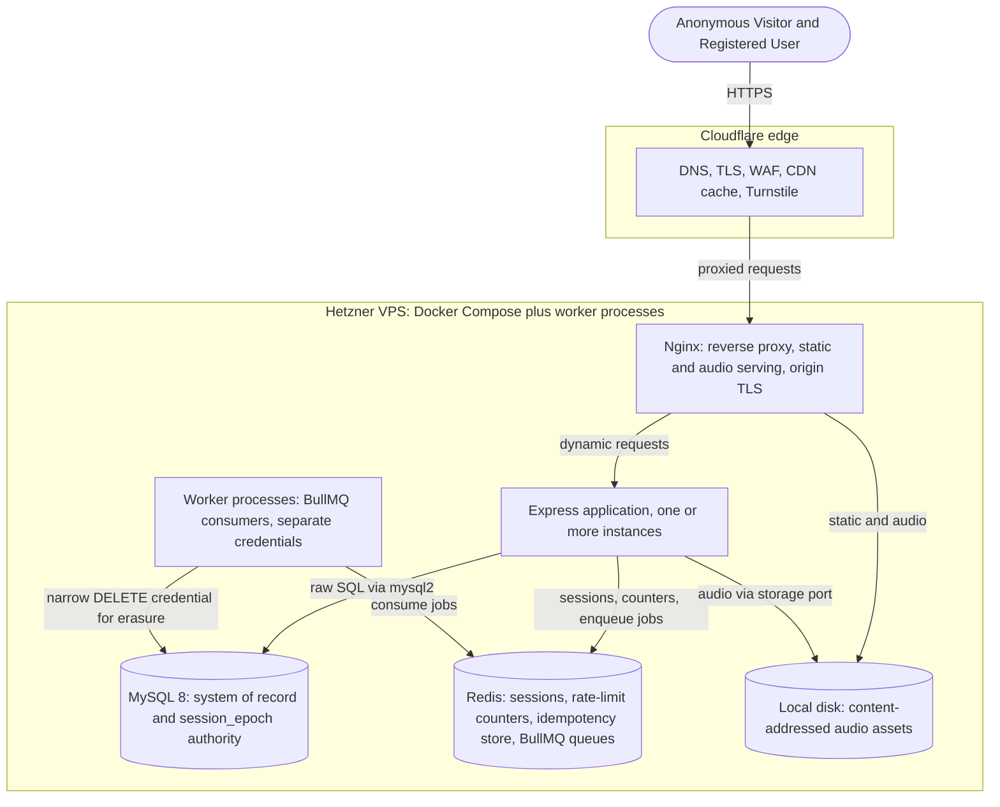
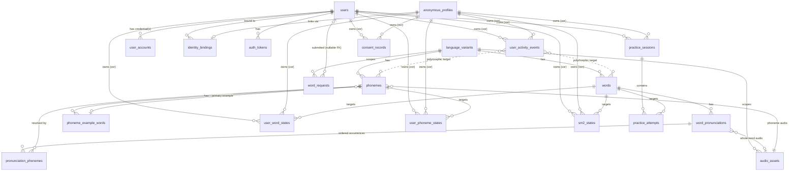

# PronounceAll — Software Design Document (SDD)

**Version:** 1.0
**Status:** Final
**Owner:** Alp K. (solo developer)

**Changelog:**
- 1.0 — Merge of SDD Rounds 2 and 3 with the Round 4 mechanical pass applied, followed by the final regression patch restoring the previously approved Flow 1 to 5 corrections. Sections 1, 2, 3, 6, and 7 are the frozen Round 2 sections; Section 4 is assembled from its layered sources with the final owner decisions applied; all six Section 5 flows are frozen; Sections 8 and 9 are complete.

This document specifies how PronounceAll is built to satisfy SRS v1.0. It assumes the SRS amendments recorded for FIND-01 through FIND-08 are applied to the requirements baseline. Source precedence and document roles are defined in `DOC_INDEX.md`: for what to build the SRS governs, for how to build it the SDD Round 1 Decisions govern, and neither is overridden here.

---

## Table of contents

1. Introduction and scope
   - 1.1 Purpose
   - 1.2 Readership
   - 1.3 Relationship to the Charter, the SRS, and the Round 1 decisions
   - 1.4 Scope of this document
   - 1.5 Technology stack
2. Actors, system boundary, and use cases
   - 2.1 Actors
   - 2.2 System boundary
   - 2.3 Use cases mapped to FR ranges
3. Architectural overview and component decomposition
   - 3.1 Architectural style and guiding principles
   - 3.2 Runtime topology
   - 3.3 Component decomposition and module map
   - 3.4 Word page composition: the cacheable shell and the hydration path
   - 3.5 Pointers to cross cutting design and the data model
4. Data model
   - 4.1 Conceptual model
   - 4.2 Catalogue and content tables
   - 4.3 Identity and authentication tables
   - 4.4 The activity event log
   - 4.5 Derived state
   - 4.6 Practice tables
   - 4.7 Legal, consent, and audit tables
   - 4.8 Indexing strategy
   - 4.9 Deletion relationships and the erasure-privilege surface
   - 4.10 Redis-resident data
   - 4.11 ERD
   - 4.12 Flags and resolved items
5. Key flows
   - 5.1 Flow 1 — Anonymous to registered merge
   - 5.2 Flow 2 — Save or tag write
   - 5.3 Flow 3 — Word page render
   - 5.4 Flow 4 — Practice session lifecycle
   - 5.5 Flow 5 — Account deletion
   - 5.6 Flow 6 — Registration across the three paths
6. Cross cutting design
   - 6.1 Error taxonomy and surfacing
   - 6.2 Logging strategy and PII redaction
   - 6.3 Caching headers and invalidation
   - 6.4 Configuration and secrets
   - 6.5 Background job model and per job idempotency
7. Directory structure and coding conventions
   - 7.1 Organisation within a layer
   - 7.2 Naming conventions
   - 7.3 The dependency rule in practice
   - 7.4 Data access and database conventions
   - 7.5 Errors, logging, and validation
   - 7.6 Security coding rules
   - 7.7 Views and client side conventions
   - 7.8 Testing and the continuous integration gate
8. Design decisions register
9. Deferrals to downstream documents

---
## 1. Introduction and scope

### 1.1 Purpose

This Software Design Document specifies how PronounceAll is built to satisfy SRS v1.0. It translates the requirements into an architecture, a component decomposition, a cross cutting design, a data model, and a set of key flows, at a level sufficient to guide implementation, with the design decisions that remain open resolved in their assigned SDD sections rather than left indefinite. It records each significant design decision with its rationale, and it names what is deferred to the API Specification, the Threat Model, and the other downstream documents so that those do not begin empty.

### 1.2 Readership

The sole maintainer acting as implementer; any future contributor working under `CONTRIBUTING.md`; and a reviewer auditing the design against the requirements and the security posture. The document assumes familiarity with the Charter and SRS v1.0 and does not reintroduce their content.

### 1.3 Relationship to the Charter, the SRS, and the Round 1 decisions

There are two primary baselines. SRS v1.0 owns what the system must do: the functional and non functional requirements and the appendices. The SDD Round 1 Decisions Document (v1.0.4) owns the settled how: the blocking resolutions B1 to B3, the cross cutting conventions C1 to C6, the content and algorithm decisions E1 to E4, and the vendor and infrastructure picks V1 to V8. Four documents are fixed inputs and are not reopened here: the Charter (vision, scope, success criteria, licensing), the amended Project Handoff Document (locked feature brief and iteration order), the Foundational Decisions (security posture, authentication model, anonymous identity, rate limits, deletion model), and the Round 4 Decisions (the sixteen settled values).

Precedence is explicit. For what to build, the SRS governs. For how to build it, the Round 1 decisions govern. Where a design decision changed a requirement, the change is recorded in the SDD Decisions §6 amendment ledger of fifteen items, which is the reconciliation record between the two baselines; the SRS text already reflects every applicable item. This document builds on those decisions and does not relitigate them.

The conflict rule carries over from the documentation router. If a requirement and a design decision disagree and the amendment ledger does not explain the difference, the conflict is reported rather than resolved silently, and no superseded document is used to settle it.

### 1.4 Scope of this document

The full SDD has nine sections, defined in SDD Handoff §3. It is produced in rounds because a single drafting pass cannot carry a document of this size. Round 2, this document, covers Sections 1, 2, 3, 6, and 7: introduction and scope; actors, system boundary, and use cases; architectural overview and component decomposition; cross cutting design; and directory structure and coding conventions. Round 3 covers Section 4 (data model) and Section 5 (the six key flow sequence diagrams). Round 4 is a mechanical merge and citation sweep that adds no new content.

### 1.5 Technology stack

This document points to the authoritative stack rather than restating it. In outline, the runtime is a server rendered EJS application on Node.js and Express, with MySQL accessed through raw SQL and no ORM, Redis for sessions and rate limiting, served behind Nginx and Cloudflare, containerized with Docker and Docker Compose, deployed to a Hetzner VPS with Certbot for TLS and GitHub Actions for continuous integration. The technology baseline is defined jointly by the Charter and SRS constraints (Charter §5, SRS §2.4 and §2.5) and by the applicable Round 1 decisions. The vendor and infrastructure picks V1 to V8 settle the text to speech tool, the Redis deployment shape, the session store, the audio storage and serving path, the transactional email provider, the off site backup target, the region, and the profanity package; and several cross cutting conventions settle technologies as well, for example Flyway for migrations (C3) and BullMQ for background jobs (C6). Those decisions are cited in Section 3 and Section 6 at the points where they bear on the design, and are not reproduced here.

---

## 2. Actors, system boundary, and use cases

### 2.1 Actors

The actor taxonomy follows the authoritative user classes in SRS §2.3: two human primary actors, one operational actor, the external services the system depends on, and an open source contributor class that sits outside the runtime system.

| Actor | Type | Description |
|---|---|---|
| Anonymous Visitor | Human, primary | A visitor without an account, identified only by the strictly necessary UUID cookie (Foundational Decisions §6). Reads every word and phoneme page, saves and tags words and phonemes, runs practice sessions, requests missing words, and sets cookie, ad, and variant preferences, all without registering. Read only if cookies are unavailable. |
| Registered User | Human, primary | An authenticated account holder, a superset of the Anonymous Visitor. Additionally registers and authenticates through the three paths, has anonymous progress merged on login, manages the account, and exercises the Right to Erasure. Identity resolves through the account rather than the anonymous cookie. |
| Maintainer / Operator | Human, operational | Alp K. and any future co maintainers. Full system access over SSH and the database; v1.0 has no in app administrator role and no admin UI (SRS §2.3, FR-CONTENT-07). Works through database queries, the idempotent seed pipeline, batch audio generation, and the Runbook procedures. The SDD Handoff used the legacy label "Administrator" for this actor; the authoritative term is Maintainer / operator. |
| External services | External systems | Six third parties the system depends on (SRS §2.3): Google OAuth, the Cloudflare edge and Turnstile, the transactional email provider, the HIBP range API, Wiktionary, and the text to speech provider. Their trust boundary position and their runtime versus build time role are set out in §2.2. |

SRS §2.3 also lists an Open source contributor class: outside developers filing issues or pull requests through the public GitHub repository. They are a non-runtime stakeholder with no access to the deployed system and no runtime use case, so they are noted here for completeness and are not modeled as a runtime actor, in the boundary diagram, or in the use case table.

The External services row enumerates the six runtime and content dependencies named as a user class in SRS §2.3: Google OAuth, the Cloudflare edge and Turnstile, the transactional email provider, the HIBP range API, Wiktionary, and the text to speech provider. Two further third-party dependencies are defined elsewhere and are operational data destinations rather than user-class external services: the off-site backup provider (Backblaze B2, SDD decision V6) and the error tracker (Sentry or equivalent, NFR-OPS-03). This is why the §2.2 boundary shows eight third parties where §2.3 lists six.

### 2.2 System boundary

The boundary drawn here is the project controlled trust boundary. The diagram does not attempt to enumerate every vendor the project ever contacts; it shows the external services and operational data destinations material to the application's runtime, content pipeline, privacy, security, and operations. Engineering and deployment services such as GitHub Actions, the certificate authority, and package registries are out of scope for this diagram. The boundary picture also feeds the Threat Model, which must inventory every third party the system exchanges personal data with (NFR-PRIV-06). Internal runtime topology, meaning the split across Nginx, Express, MySQL, and Redis, is not decomposed here; that is Section 3.

```mermaid
flowchart LR
    AV(["Anonymous Visitor"])
    RU(["Registered User"])
    MO(["Maintainer / Operator"])

    CF["Cloudflare edge and Turnstile"]

    subgraph TB["PronounceAll project-controlled trust boundary"]
        APP["PronounceAll application and data stores"]
        PIPER["Piper TTS batch tooling"]
    end

    GOO["Google OAuth"]
    HIBP["HIBP range API"]
    MAIL["Transactional email provider"]
    BKP["Backblaze B2 backup"]
    SENTRY["Error tracker: Sentry or equivalent"]
    WIK["Wiktionary source"]
    CTTS["Cloud TTS provider, fallback"]

    AV -->|"HTTPS"| CF
    RU -->|"HTTPS"| CF
    CF -->|"proxied requests, Turnstile check"| APP
    MO -->|"SSH, DB, seed CLI"| APP

    APP -->|"OAuth 2.0, registration and login"| GOO
    APP -->|"SHA-1 prefix, k-anonymity"| HIBP
    APP -->|"verification, reset, deletion mail"| MAIL
    APP -->|"nightly encrypted backup"| BKP
    APP -->|"5xx and unhandled errors, PII scrubbed"| SENTRY

    WIK -->|"seed fetch, build time"| APP
    APP -->|"batch generation, build time"| PIPER
    CTTS -.->|"ranked fallback, build time"| APP
```



Notes on the boundary. The external parties material to this diagram fall into three groups.

Request-path application third parties, which receive personal data as part of serving users: Google OAuth (email, subject identifier, and profile picture URL on login), the Cloudflare edge and Turnstile (client IP, request metadata, and the Turnstile token payload), the HIBP range API (a five character SHA-1 prefix only, under k anonymity), and the transactional email provider (recipient address and token URL). Human visitors reach the origin through the Cloudflare edge over HTTPS; the Maintainer / Operator reaches the origin through operational channels and not through the web application. The Google edge carries both registration and login, since Google is one of the three registration paths (FR-AUTH-04, FR-AUTH-16).

Operational data destinations, which receive data outside the request path. The off-site backup at Backblaze B2 (V6, NFR-OPS-01) holds a logical database backup containing the personal data stored in MySQL; it is shown here because the reconciled NFR-PRIV-06 treats the encrypted off-site database backup as a personal-data destination (recorded as FIND-02, applied via the NFR-PRIV-06 amendment). The error tracker (NFR-OPS-03) receives exception and 5xx diagnostics with named user PII scrubbed before transmission; whether its residual metadata constitutes a personal-data flow is determined in the Threat Model, and any confirmed personal-data exposure must be reflected in NFR-PRIV-06 and the Privacy Policy before production use. The error tracker is modeled as external because NFR-OPS-03 specifies a hosted service on a free tier.

Build time content dependencies, which exchange no personal data: Wiktionary (dictionary meanings, pronunciations, and human recordings) and, only if ever needed, the cloud text to speech provider used as the ranked fallback to Piper.

Two modeling points are stated explicitly. Piper is self hosted, project controlled batch tooling, so it sits inside the trust boundary and is invoked only at build time; it is distinct from the external cloud text to speech provider, the ranked fallback per V1. The request path makes no call to any text to speech provider; it serves human recordings or pre generated assets and falls back to the client side Web Speech API. That third tier of the whole word audio fallback chain (FR-IPA-05) is a capability of the visitor's own user agent, not a separate actor or external service, because it executes client side and reaches no project or third party service.

### 2.3 Use cases mapped to FR ranges

Each use case below is a goal level interaction mapped to the functional requirement range that governs it. The mapping is deliberately to FR ranges, per the handoff; the small number of use cases additionally governed by an NFR family or a Round 1 decision are noted after the table. A UC identifier is introduced so the Round 3 sequence flows can reference these use cases directly. The mapping is a near partition: every functional requirement lands in exactly one use case, with the exceptions of the genuinely cross cutting FR-AUTH-20 and the deliberately out of scope FR-PRACTICE-07 (Won't for v1.0), both noted below.

| UC | Use case | Actors | Governing FR range |
|---|---|---|---|
| UC-01 | View a word page: meaning, IPA transcriptions, syllable and stress, whole word audio control | Anonymous Visitor, Registered User | FR-WORD-01..03, FR-WORD-07..09; FR-IPA-02, FR-IPA-09; FR-CONTENT-05 |
| UC-02 | Play word and per phoneme audio and open the phoneme popover | Anonymous Visitor, Registered User | FR-IPA-03..06; FR-SAVE-09 |
| UC-03 | Browse the IPA learning pages and the progress aware banner | Anonymous Visitor, Registered User | FR-WORD-06; FR-IPA-07, FR-IPA-08, FR-IPA-10 |
| UC-04 | Save and tag a word or phoneme across the three states | Anonymous Visitor, Registered User | FR-SAVE-01..08; FR-AUTH-01..03; FR-AUTH-17 |
| UC-05 | Run a self assessment practice session with SM-2 | Anonymous Visitor, Registered User | FR-PRACTICE-01..06 |
| UC-06 | Resolve an unknown word: 404, fuzzy suggestions, word request | Anonymous Visitor, Registered User | FR-WORD-04, FR-WORD-05 |
| UC-07 | Register and authenticate across the three paths | Anonymous Visitor becoming Registered User, Google OAuth | FR-AUTH-04..16; FR-CONSENT-04 |
| UC-08 | Merge anonymous progress on login, same device and cross device | Registered User, from Anonymous Visitor | FR-AUTH-18, FR-AUTH-19 |
| UC-09 | Manage the account: settings, account actions, logout | Registered User | FR-SET-01, FR-SET-02, FR-SET-06 |
| UC-10 | Delete the account: soft delete grace, hard delete erasure | Registered User | FR-SET-07..09 |
| UC-11 | Set preferences and handle consent: cookies, ads, variant | Anonymous Visitor, Registered User | FR-CONSENT-01..03, FR-CONSENT-05, FR-CONSENT-06; FR-SET-03, FR-SET-04, FR-SET-05, FR-SET-10 |
| UC-12 | View the open source banner and repository links | Anonymous Visitor, Registered User | FR-OSS-01, FR-OSS-02 |
| UC-13 | Seed and maintain dictionary and phoneme content | Maintainer / Operator, Wiktionary, TTS provider | FR-CONTENT-01..04, FR-CONTENT-06; FR-WORD-10; FR-IPA-01 |
| UC-14 | Triage word requests: review, accept, reject, re seed | Maintainer / Operator | FR-CONTENT-07 |

Cross cutting requirements, not owned by a single use case. FR-AUTH-20 requires CSRF protection on every state changing POST, PATCH, and DELETE endpoint, so it spans all write bearing use cases; the concrete endpoint coverage is owned by the API Specification and the later design rather than enumerated here. Bot protection and rate limiting are scoped precisely by their own requirements: FR-AUTH-14 requires a Turnstile token on register, login, reset-password, and request-word, so it protects UC-07 and UC-06; FR-AUTH-15 enforces the authentication endpoint rate limits only, on login, register, reset-password, and verify-email/resend, so it protects UC-07; the word request rate limit is a separate rule owned by FR-WORD-05 within UC-06. FR-IPA-08 governs example word selection wherever the example appears, so it also constrains the popover in UC-02 in addition to the learning pages in UC-03.

Co-governance beyond FR ranges, where it materially shapes the use case. UC-04 and UC-08 rest on the event log identity model B1 and the event ordering convention C5. UC-10 is additionally governed by the privacy requirements NFR-PRIV-01 to NFR-PRIV-03. UC-13 additionally follows the seed pipeline decision E1 and the audio provenance obligations folded into FR-CONTENT-04, and the whole word audio behaviour in UC-02 follows the fallback design in FR-IPA-05 and the text to speech decision V1. Operational background jobs that are not FR mapped use cases, meaning retention pruning (NFR-PRIV-02), off site backups (NFR-OPS-01 and NFR-OPS-02), derived state reconciliation (B3), and batch audio generation (V1), are specified in Section 6 as part of the background job model rather than in this table; the single deletion job that is FR governed, the account hard delete purge (FR-SET-08), is covered within UC-10.

---

## 3. Architectural overview and component decomposition

### 3.1 Architectural style and guiding principles

PronounceAll is a single server rendered web application, not a single page app and not a client of a separate backend. HTML is composed on the server with EJS, and the browser receives readable pages that it progressively enhances. Data access is raw SQL through `mysql2`, with no ORM. The application is deployed as a small set of containers on one VPS and may run as several Express instances behind Nginx.

Four principles, fixed in the Round 1 decisions, shape the structure and are stated here because everything below follows from them.

Layered dependency (C4). The code is organised by layer. Routes depend on services, services depend on repositories, and repositories own all SQL. Routes stay thin: they parse and validate the request, call a service, and render or serialise the result. Business logic lives in services and is written to be independent of Express where possible. This confines the database to one layer and keeps the request framework out of the domain.

Infrastructure invokes domain, never the reverse (C4). BullMQ, the logger, the database pool, and the Redis client are boundary concerns. Concrete infrastructure clients are consumed by adapters, repositories, and the composition root, not by business services; a service receives what it needs as a function argument or an injected interface. A job handler or a worker is a thin adapter that deserialises a payload, calls a service function, and maps the outcome to success, failure, or retry.

One implementation, several entry points (C4). A unit of logic such as account deletion or derived state reconciliation is written once in a service and reached from several thin adapters: an HTTP route, a scheduled BullMQ job, a standalone worker, or a one off script. No logic is duplicated across those entry points.

Ports and adapters for non database infrastructure (C4, V4). Where the domain depends on infrastructure that is not the database, it depends on a port, and the concrete client is an adapter behind that port. Audio storage is the worked example: domain logic depends on a storage port, and the local filesystem is one adapter behind it, so a later object storage backend is a new adapter and not a change to domain logic. Repositories remain reserved for database access and do not become a home for non database infrastructure.

A fifth constraint is not an architectural principle but drives the others: the system must be operable by a single maintainer, so every moving part is chosen so that one person can deploy, observe, and recover it.

### 3.2 Runtime topology

The production deployment is Docker Compose on one Hetzner VPS in an EU region (V7), behind Cloudflare. The runtime components are the Cloudflare edge, Nginx, the Express application, MySQL 8, Redis, the local audio volume, and the standalone worker processes. Section 2 draws the trust boundary and the external parties; this section decomposes what Section 2 left as a single application box.



The delivery path. Visitors reach the Cloudflare edge over HTTPS. The edge terminates TLS, applies the WAF and edge rate limiting, serves cached shells and audio, and hosts the Turnstile challenge. It forwards uncached requests to Nginx over an origin connection secured by a Certbot provisioned certificate. Nginx is the reverse proxy and the static and audio file server: dynamic requests go to the Express application, and content addressed audio and other static assets are served directly from the local volume.

The application tier. The Express application holds the routes, services, repositories, middleware, and validators. It reads and writes MySQL through repositories using raw SQL, uses Redis for sessions, rate limit counters, the idempotency store, and job enqueueing, and reaches audio through the storage port. It may run as more than one instance behind Nginx, which is the reason two infrastructure decisions take the shape they do: rate limiting is backed by Redis rather than in process memory so a limit is shared across instances (Foundational Decisions §10), and background work is dispatched through BullMQ rather than an in process scheduler so a recurring job fires once rather than once per instance (C6).

The data tier. MySQL 8 is the system of record and the authority for session validity: the `users` row carries the `session_epoch` that a session is checked against on every authenticated request (V3). Redis is a single self hosted instance carrying four workloads, the ephemeral rate limit counters and idempotency keys and the durable sessions and BullMQ queues, with AOF persistence and a `noeviction` memory policy, so its memory is a monitored signal rather than something left to evict silently (V2).

The worker tier. Background jobs run in standalone worker processes, separate from the Express application, consuming BullMQ queues from the same Redis (C6). The workers are where privilege separation becomes physical: the erasure workers hold a narrow `DELETE` credential that the application role does not have (B1, V6, C6), so destructive operations cannot originate from a request handler. The recurring reconciliation, the post grace hard deletion, the dormancy purge, and the TTS batch all run here.

Build time and operational dependencies. Piper runs as project controlled batch tooling at content build time and is not on the request path (V1); the request path serves human recordings or pre generated assets and falls back to the client side Web Speech API. The nightly encrypted backup to Backblaze B2 (V6, NFR-OPS-01) and error reporting to the hosted error tracker (NFR-OPS-03) are operational flows; both appear on the Section 2 boundary, and their mechanics belong to Section 6 and the operations requirements rather than to this topology.

### 3.3 Component decomposition and module map

The canonical source layout, fixed in C4 and recorded here as the authoritative module map, is layer oriented and can be reorganised into feature oriented directories later without changing the dependency rules.

```
src/
  routes/
  services/
  repositories/
  middleware/
  validators/
  errors/
  config/
  lib/
  views/
  public/
  workers/
  jobs/
migrations/
scripts/
tests/
```

Layer responsibilities, as fixed in C4:

- `routes/`: HTTP routing and thin request and response handling.
- `services/`: domain and business logic, independent of Express where possible.
- `repositories/`: all database access and raw SQL; the only normal application layer that talks directly to `mysql2`.
- `middleware/`: authentication and session handling, CSRF, rate limiting, request logging, and the error middleware.
- `validators/`: request and input validation schemas and logic.
- `errors/`: `AppError`, stable error codes, and related definitions.
- `config/`: environment and configuration loading.
- `lib/`: shared infrastructure clients and utilities, for example the logger, the database pool, the Redis and BullMQ connection setup, crypto helpers, and id generation.
- `views/`: EJS templates and partials.
- `public/`: browser side JavaScript, CSS, images, audio, and other static assets.
- `workers/`: standalone worker entry points that run separately from the Express application, including the deletion worker with its separate database credentials.
- `jobs/`: reusable BullMQ job definitions and handlers, keeping queue and scheduling concerns separate from the underlying service logic.
- `migrations/`: versioned Flyway SQL migrations.
- `scripts/`: one off operational, import, seed, and reconciliation utilities.
- `tests/`: unit, integration, and end to end tests.

The dependency rule and the inversion principle stated in §3.1 apply to this map directly: concrete infrastructure clients in `lib` are consumed only by adapters, repositories, and the composition root, never by business services, and the `jobs` and `workers` split exists so that queue and worker concerns are thin adapters over service logic that is reachable without the queue.

Three mechanisms are worth locating explicitly against this map.

The event log and derived state (B3, C5). A save or tag action is a service operation that, within one MySQL transaction, appends the event row to `user_activity_events` and upserts the derived state row, keyed on the viewer identity resolved through `identity_bindings` (B1). Ordering for any latest event resolution is `(occurred_at, event_id)` (C5). The `audio_listen_*` and `practice_attempt` events are excluded from derived state per FR-SAVE-04, and the 30 second idempotency window (FR-SAVE-08) is enforced at the write. The scheduled reconciliation job recomputes the derived tables as a drift safety net.

Sessions (V3). Session handling lives in middleware; the session store is Redis, reached through a `lib` client; and the authoritative epoch is a column on the MySQL `users` row, read on every authenticated request as a single primary key lookup. Password change and invalidation are atomic in MySQL, since the same transaction sets the new hash and increments the epoch, so no cross datastore transaction is needed and a session whose stored epoch no longer matches fails closed.

The storage port (V4). The storage port is a domain facing interface; the filesystem adapter lives with the other infrastructure clients, in a `storage` or `adapters/storage` module, not in `repositories/`, which C4 reserves for database access.

### 3.4 Word page composition: the cacheable shell and the hydration path

B2 splits the word page into a cacheable public shell and a per viewer hydration layer. The shell is the reader content, meaning the word, its meaning, the IPA transcriptions with clickable phonemes, the whole word audio control, and the syllable and stress breakdown. It is identical for every viewer of a word, server rendered, readable with no JavaScript, and given long lived edge cache headers at Cloudflare. The per viewer layer, meaning the save and tag state of the words and phonemes on the page and the progress banner count, is delivered by a small client side hydration endpoint that returns JSON and is not shared across viewers. This is also the progressive enhancement seam: the reader content works without JavaScript, and the personalisation that needs JavaScript is exactly the layer that degrades. Because the shell is shared and edge cached, the anonymous identity cookie `pa_uid` is issued and its sliding `Max-Age` refreshed on the uncached hydration or bootstrap path and other origin reaching requests, never on the cached shell response (amended FR-AUTH-01). For the same reason the shell cannot carry a per response CSP nonce, so it contains no inline script or style and takes a nonce free `script-src 'self'` and `style-src 'self'` policy while the per request nonce applies to uncached responses, specified in §6.3 (amended NFR-SEC-03).

Structuring decision taken here, within the C4 rules, alternative noted. The hydration endpoint is a thin route over a read oriented service method that resolves the viewer identity through the `current_identity_bindings` view (B1) and reads the derived state tables (B3) together with the learned phoneme count for the active variant, returning JSON. The save and tag write path is a separate service method over the same repositories. Read and write are kept as separate service operations rather than one combined state service, because the shell and hydration split is already a read and write seam, and separating them keeps each side simple and independently testable while keeping the route thin per C4, since the identity resolution and the banner count are small pieces of logic that belong in a service rather than a route. The considered alternative was a single state service exposing both the writes and the hydration read; it is workable but blurs the seam B2 introduces for a small saving. This is a routine structuring choice recorded for completeness, not a blocking decision. NFR-PERF-05, as amended, sets the 50 ms shell budget and measures the hydration path separately (ledger item 4).

The detailed request and response sequences, the word page render with its audio fallback, the save and tag write, the merge on login, the practice session, the account deletion, and registration across the three paths, are the six flows drawn in Section 5 (Round 3). This section fixes the static structure they operate within.

### 3.5 Pointers to cross cutting design and the data model

Two bodies of design referenced by the components above are specified in their own sections rather than here. The cross cutting mechanics, meaning the error taxonomy and surfacing (C2), the logging strategy and PII redaction (C1), the caching headers and invalidation, configuration and secrets, and the background job model with its per job idempotency (C6), are Section 6. The data model, meaning the table by table schema, the ERD, the indexing strategy, and the derived state design, is Section 4 (Round 3). The small state columns the job model implies, a deletion state on the account, a claim marker on the anonymous profile, and a status on the audio asset row (C6), are formalised in that schema round.
## 4. Data model

This section is assembled from the original Section 4 draft (base layer), the Section 4 correction pass, the Round 3 handoff §10 assembly edits, and the final owner decisions recorded in the SDD final assembly handoff, applied in that order. The ERD in §4.11 is the revised diagram from the correction pass. Where the base draft and a later layer disagreed, the later layer governs; the reconciliations are visible in §4.12.

### 4.1 Conceptual model

The data divides into five groups, and the division is the design. Catalogue data is the seeded, non personal content: language variants, words, pronunciations, the ordered pronunciation to phoneme occurrence mapping, phonemes, example words, and audio assets. Identity data is who a viewer is: registered users and their credentials, anonymous profiles, and the append only bindings that link an anonymous identity to an account. History of record is the append only truth: the activity event log and the identity bindings, neither of which application code may ever update or delete. Derived state is the fast, mutable projection of that history: the save and tag state per target and the SM-2 scheduling state, upserted synchronously in the same transaction as the event (B3). Legal and audit data is the consent record, the auth workflow tokens, and the PII free deletion tombstone.

Three invariants shape everything below. First, progress is history: a save or tag is an appended event, and the visible state is derived from it (B1, B3), so the destructive surface can be confined to one credential. Second, identity is resolved, not rewritten: an anonymous visitor who registers is linked by an appended LINK row, never by editing past events (B1). Third, personal data is minimised and bounded: every personal field traces to a justifying requirement and a retention rule (Appendix E, NFR-PRIV-01, NFR-PRIV-02).

Conventions follow §7.2 and C5 and are not repeated per table: snake_case identifiers, plural table names, singular columns, surrogate `BIGINT` primary keys except where a natural key is authoritative, event and binding timestamps as `DATETIME(3)` in UTC with a monotonic `BIGINT` for tie breaking, and all temporal columns in UTC.

### 4.2 Catalogue and content tables

These hold no personal data. They are written by the seed and content tooling (E1, and the TTS batch of C6), never by the runtime request path, which only reads them (privilege detail in §4.9).

**`language_variants`** (FR-CONTENT-06, E1).

| Column | Type | Constraints |
|---|---|---|
| `variant_id` | `SMALLINT` | PK |
| `code` | `VARCHAR(16)` | UNIQUE, not null (for example `en-us`) |
| `display_name` | `VARCHAR(64)` | not null (for example American English) |
| `is_active` | `BOOLEAN` | not null, default false |

Routes to a variant whose row is absent or `is_active = false` return 404 (FR-WORD-01, FR-CONTENT-06). v1.0 seeds exactly one active row.

**`words`** (E4, FR-WORD-01/02/03, FR-CONTENT-01).

| Column | Type | Constraints |
|---|---|---|
| `word_id` | `BIGINT` | PK |
| `variant_id` | `SMALLINT` | FK → `language_variants`, not null |
| `normalized_headword` | `VARCHAR(128)` | not null (lower, NFC, trimmed per FR-WORD-02) |
| `display_headword` | `VARCHAR(128)` | not null |
| `meaning` | `TEXT` | not null (word level; no sense hierarchy in v1.0, E4) |
| `source_url` | `VARCHAR(512)` | not null (upstream entry, FR-CONTENT-01/05) |
| `source_licence` | `VARCHAR(64)` | not null (for example CC BY-SA 4.0) |
| `retrieved_at` | `DATE` | not null |

Constraint: `UNIQUE (variant_id, normalized_headword)` (E4). Meaning is stored at the word level with a single attribution; a full sense model is a post v1.0 register idea (E4).

**`word_pronunciations`** (E4, FR-WORD-03, ledger 9).

| Column | Type | Constraints |
|---|---|---|
| `pronunciation_id` | `BIGINT` | PK |
| `word_id` | `BIGINT` | FK → `words`, not null |
| `ipa_transcription` | `VARCHAR(256)` | not null (includes stress markers `ˈ` `ˌ`) |
| `syllable_breakdown` | `VARCHAR(256)` | not null (the written syllable and stress display, FR-WORD-03) |
| `gloss` | `VARCHAR(128)` | nullable (heteronym disambiguation, E4) |
| `is_primary` | `BOOLEAN` | not null |
| `display_order` | `SMALLINT` | not null |
| `whole_word_audio_asset_id` | `BIGINT` | FK → `audio_assets`, nullable |

Many rows per word, so heteronyms such as `lead` live under one word (E4). Exactly one primary per word and a deterministic order, both validated at ingestion (E4, FR-WORD-03): enforced by `UNIQUE (word_id, display_order)` plus a generated column `is_primary_flag` participating in `UNIQUE (word_id, is_primary_flag)` where the flag is the word id when primary and null otherwise, which lets MySQL enforce at most one primary per word declaratively, with the ingestion validator asserting exactly one. Natural key: `UNIQUE (word_id, ipa_transcription)` is the stable ingestion upsert key, so a seed re-run converges rather than duplicating or re-identifying pronunciations; `is_primary` and `display_order` are populated and updated by the upsert but are not the row's content identity. The schema permits a per pronunciation whole word audio asset; the presentation rule for secondary pronunciation audio is fixed in §4.12.

**`phonemes`** (FR-IPA-01, FR-IPA-07/08, E2).

| Column | Type | Constraints |
|---|---|---|
| `phoneme_id` | `BIGINT` | PK |
| `variant_id` | `SMALLINT` | FK → `language_variants`, not null |
| `ipa_symbol` | `VARCHAR(16)` | not null (NFC normalised) |
| `frequency_rank` | `SMALLINT` | not null |
| `audio_asset_id` | `BIGINT` | FK → `audio_assets`, not null |
| `primary_example_word_id` | `BIGINT` | FK → `phoneme_example_words`, nullable at insert, non null after seed |

Constraints: `UNIQUE (variant_id, ipa_symbol)` and `UNIQUE (variant_id, frequency_rank)` (dense, unique 1..N per variant, FR-IPA-01). `primary_example_word_id` is nullable at insert only to break the circular reference with `phoneme_example_words`; the seed transaction inserts the phoneme, inserts its example words, then sets the pointer, and the seed validator asserts it is non null at completion (FR-IPA-01). Both the audio and example pointers being non null are seed invariants, not runtime nullable states.

The `en-us` rows are seeded from the **PronounceAll en-US Pedagogical IPA Inventory v1**, the canonical broad American English teaching and transcription convention documented in the standalone phoneme example-word artifact (D4). That inventory derives 41 teaching units: 24 consonants, 12 vowel and central rhotic teaching units, and 5 atomic diphthongs. The count is a consequence of the documented list, not an independent count constraint on this table, and the artifact, not this schema, is authoritative for the symbol set and its transcription conventions (American R is canonical `/ɹ/`; the five diphthongs are atomic teaching units; other vowel plus R combinations are compositional, per §4.2 `pronunciation_phonemes`).

**`phoneme_example_words`** (FR-IPA-03/08, E2).

| Column | Type | Constraints |
|---|---|---|
| `example_word_id` | `BIGINT` | PK |
| `phoneme_id` | `BIGINT` | FK → `phonemes`, not null |
| `example_word` | `VARCHAR(128)` | not null |
| `phonemic_transcription` | `VARCHAR(256)` | not null |
| `match_mode` | `ENUM('sound','spelling')` | not null |
| `source_reference` | `VARCHAR(512)` | not null (per row attribution for CC BY-SA, E2) |

Natural key: `UNIQUE (phoneme_id, example_word)` is the stable ingestion upsert key for the seeded example rows. The displayed example is the `match_mode = 'sound'` row (FR-IPA-08). Seed validation asserts the target phoneme appears somewhere in `phonemic_transcription`, preferring a word initial example where the phoneme permits and allowing any position otherwise (the FIND-01 fix, E2, ledger 6 and 12).

**`pronunciation_phonemes`** (FR-WORD-03, FR-IPA-02, E1). New junction table. Every rendered phoneme occurrence resolves to a stable `phoneme_id` through this table rather than by reparsing the IPA string at render time.

| Column | Type | Constraints |
|---|---|---|
| `pronunciation_id` | `BIGINT` | FK → `word_pronunciations`, not null |
| `position` | `SMALLINT` | not null (0-based order within the transcription) |
| `phoneme_id` | `BIGINT` | FK → `phonemes`, not null |

Primary key and natural key: the composite `(pronunciation_id, position)`. Each row is one clickable phoneme element on the word page, carrying its `data-phoneme-id` (FR-IPA-02); ordered by `position` it reproduces the transcription. Tokenization is performed server side at seed time using longest-match rules into a stable `phoneme_id` sequence, so no IPA reparsing occurs at render and browser JavaScript never linguistically parses IPA strings. Under the canonical inventory, vowel plus R combinations are compositional: the vowel in `car`, `/ɑɹ/`, tokenizes to two rows, `/ɑ/` at one position and `/ɹ/` at the next, not to a single r-coloured unit. The five diphthongs remain single atomic units and so occupy one row each.

**`audio_assets`** (FR-CONTENT-03/04, V4, E4, C6).

| Column | Type | Constraints |
|---|---|---|
| `audio_asset_id` | `BIGINT` | PK |
| `variant_id` | `SMALLINT` | FK → `language_variants`, not null |
| `asset_key` | `VARCHAR(255)` | UNIQUE, not null (deterministic key: kind, target, voice or version, C6) |
| `storage_key` | `VARCHAR(255)` | UNIQUE, nullable until ready (content addressed filename, V4) |
| `sha256` | `CHAR(64)` | nullable until ready (FR-CONTENT-04) |
| `mime_type` | `VARCHAR(64)` | nullable until ready |
| `byte_length` | `INT` | nullable until ready, non zero when ready |
| `generation_status` | `ENUM('pending','claimed','ready','failed')` | not null, default pending |
| `source_kind` | `ENUM('wiktionary_human','tts_piper','tts_cloud')` | not null |
| `source_reference` | `VARCHAR(512)` | nullable (upstream URL for human recordings) |
| `author` | `VARCHAR(255)` | nullable |
| `licence_identifier` | `VARCHAR(64)` | not null |
| `licence_url` | `VARCHAR(512)` | nullable |
| `attribution_text` | `VARCHAR(512)` | nullable |
| `retrieved_at` | `DATE` | nullable |
| `created_at` | `DATETIME(3)` | not null |

The `UNIQUE (asset_key)` plus `generation_status` is the C6 idempotency mechanism for the TTS batch: two workers that both see an asset missing cannot both generate it, because the claim is an atomic compare and set on `generation_status` under the unique key. `storage_key` is content addressed and immutable (V4), so a regenerated asset is a new file. Provenance and licence are per asset because Wikimedia recordings carry their own licences (E4, FR-CONTENT-04); the seed validate stage rejects or flags licence incompatible assets assessed against actual use (E4, ledger 7). Raw upstream IPA and other source notation are preserved in the ingestion artifact and logs, not as a runtime column on any catalogue table.

**`word_requests`** (FR-WORD-05, FR-CONTENT-07, Appendix E).

| Column | Type | Constraints |
|---|---|---|
| `request_id` | `BIGINT` | PK |
| `variant_id` | `SMALLINT` | FK → `language_variants`, not null |
| `normalized_word` | `VARCHAR(128)` | not null |
| `submitted_by_user_id` | `BIGINT` | FK → `users`, nullable |
| `submitted_by_anonymous_id` | `CHAR(36)` | nullable scalar, **no FK** |
| `upvote_count` | `INT` | not null, default 1 |
| `status` | `ENUM('open','accepted','rejected')` | not null, default open |
| `created_at` | `DATETIME(3)` | not null |
| `updated_at` | `DATETIME(3)` | not null |

Constraint: `UNIQUE (variant_id, normalized_word)`. A duplicate submission increments `upvote_count` rather than inserting a row (FR-WORD-05). `submitted_by_anonymous_id` is a nullable scalar without a foreign key, because a fresh UUID may submit a request before any `anonymous_profiles` row exists (FR-AUTH-03 creates the profile only on a progress write), so a request may be the first write performed by that UUID. On account hard delete, `submitted_by_user_id` is nulled; on dormancy prune, the scalar `submitted_by_anonymous_id` is nulled; in both cases the request survives ownerless (Appendix E, FR-SET-08). Per submitter upvote deduplication would need a votes table and an Appendix E addition; it is not required by v1.0 and is not added, since the endpoint is rate limited (FR-WORD-05) and the count is advisory.

### 4.3 Identity and authentication tables

**`users`** (FR-AUTH-04/05, V3, C6, FR-SET-07/09, Appendix E).

| Column | Type | Constraints |
|---|---|---|
| `user_id` | `BIGINT` | PK (pseudonymous) |
| `username` | `VARCHAR(20)` | not null (stored as typed) |
| `username_lower` | `VARCHAR(20)` | UNIQUE, not null (case insensitive comparison, FR-AUTH-05) |
| `session_epoch` | `INT` | not null, default 0 (authoritative session validity, V3) |
| `deletion_state` | `ENUM('none','soft_deleted','hard_delete_scheduled','hard_delete_in_progress')` | not null, default none |
| `soft_deleted_at` | `DATETIME(3)` | nullable |
| `hard_delete_scheduled_at` | `DATETIME(3)` | nullable |
| `created_at` | `DATETIME(3)` | not null |
| `updated_at` | `DATETIME(3)` | not null |

`session_epoch` lives here so the per request epoch check is a single primary key lookup (V3). `deletion_state` is the account claim column C6 requires: the hard delete worker flips `hard_delete_scheduled` to `hard_delete_in_progress` as an atomic compare and set so one worker owns the deletion. A password change updates `user_accounts.password_hash` and increments `users.session_epoch` in one MySQL transaction (FIND-06, §4.12). Username uniqueness is `username_lower`; reserved and profanity rejection is enforced at the application layer (Appendix A, FR-AUTH-05), not by the schema.

**`user_accounts`** (FR-AUTH-04/06/08/09/16, Appendix E).

| Column | Type | Constraints |
|---|---|---|
| `account_id` | `BIGINT` | PK |
| `user_id` | `BIGINT` | FK → `users`, not null |
| `provider` | `ENUM('password','google')` | not null |
| `email` | `VARCHAR(320)` | nullable |
| `email_lower` | `VARCHAR(320)` | nullable |
| `email_verified_at` | `DATETIME(3)` | nullable |
| `password_hash` | `CHAR(60)` | nullable (bcrypt `$2b$12$…`, FR-AUTH-08) |
| `google_sub` | `VARCHAR(255)` | nullable |
| `profile_picture_url` | `VARCHAR(512)` | nullable |
| `created_at` | `DATETIME(3)` | not null |
| `updated_at` | `DATETIME(3)` | not null |

Constraints: `UNIQUE (email_lower)` enforces email uniqueness across all accounts that have an email, verified or pending (FR-AUTH-06); `UNIQUE (google_sub)`; `UNIQUE (user_id, provider)` so a user holds at most one row per method. `password_hash` is populated only for the password provider, `google_sub` only for google. Modelling credentials as one row per method keeps `users` as pure identity and matches the Appendix E placement of these fields (FIND-06, §4.12).

**`anonymous_profiles`** (FR-AUTH-03, C6, NFR-PRIV-02, Appendix E).

| Column | Type | Constraints |
|---|---|---|
| `anonymous_id` | `CHAR(36)` | PK (the `pa_uid` UUID v4, FIND-05) |
| `created_at` | `DATETIME(3)` | not null |
| `last_seen_at` | `DATETIME(3)` | not null |
| `prune_claimed_at` | `DATETIME(3)` | nullable (dormancy purge atomic claim marker, C6) |

A row is created only on the first write from a UUID (FR-AUTH-03), not on read. `last_seen_at` drives the two year dormancy prune of unbound identities (NFR-PRIV-02); `prune_claimed_at` is the C6 per profile claim column that makes concurrent purge runs safe.

**`identity_bindings`** (B1, C5, FR-AUTH-18/19, FR-SAVE-03, Appendix E).

| Column | Type | Constraints |
|---|---|---|
| `binding_id` | `BIGINT` | PK, AUTO_INCREMENT (monotonic tie breaker, C5) |
| `anonymous_id` | `CHAR(36)` | FK → `anonymous_profiles`, UNIQUE, not null |
| `user_id` | `BIGINT` | FK → `users`, not null |
| `event_type` | `ENUM('LINK')` | not null |
| `occurred_at` | `DATETIME(3)` | not null (UTC, C5) |

Append only history of record. `UNIQUE (anonymous_id)` enforces the B1 invariant of at most one LINK per anonymous identity, so an anonymous identity binds to at most one account while a user may hold many bound identities across devices (FR-AUTH-19). LINK is the only value and belongs solely to this table, kept out of the `user_activity_events` vocabulary (FR-SAVE-03, ledger 3). No UNLINK exists in v1.0 (B1).

**`current_identity_bindings`** (SQL view, B1). A plain SQL view over `identity_bindings`, `SELECT anonymous_id, user_id FROM identity_bindings`, giving the straight anonymous to user resolution the hot path needs. Resolution is fast because `identity_bindings.anonymous_id` is unique and indexed, not because the view is materialised or itself indexed; it is a view rather than a table because the binding set is tiny and a view removes a write and reconciliation path (B1).

**`auth_tokens`** (FR-AUTH-09/10/11, NFR-SEC-10, NFR-SEC-12, Appendix E).

| Column | Type | Constraints |
|---|---|---|
| `token_id` | `BIGINT` | PK |
| `user_id` | `BIGINT` | FK → `users`, not null |
| `token_type` | `ENUM('email_verification','password_reset')` | not null |
| `token_hash` | `CHAR(64)` | not null (SHA-256 of the CSPRNG token; raw token only in the emailed link) |
| `expires_at` | `DATETIME(3)` | not null (24 h verification, 1 h reset) |
| `consumed_at` | `DATETIME(3)` | nullable (single use) |
| `created_at` | `DATETIME(3)` | not null |

The raw token is generated from a CSPRNG with at least 128 bits (NFR-SEC-12) and never stored; only its hash is kept, since NFR-SEC-10 forbids storing usable tokens. Issuing a new token of a type invalidates the prior unconsumed tokens of that type for the user (FR-AUTH-10, FR-AUTH-11). Expired tokens are pruned nightly (NFR-PRIV-02).

### 4.4 The activity event log

**`user_activity_events`** (FR-SAVE-03/04/05/09, B1, C5, Appendix E). The append only heart of the model.

| Column | Type | Constraints |
|---|---|---|
| `event_id` | `BIGINT` | PK, AUTO_INCREMENT (C5) |
| `anonymous_id` | `CHAR(36)` | FK → `anonymous_profiles`, nullable |
| `user_id` | `BIGINT` | FK → `users`, nullable |
| `target_kind` | `ENUM('word','phoneme')` | not null |
| `target_id` | `BIGINT` | not null (polymorphic, see below) |
| `event_type` | `ENUM('save','unsave','tag_change','audio_listen_word','audio_listen_phoneme','practice_attempt')` | not null |
| `event_value` | `VARCHAR(16)` | nullable |
| `occurred_at` | `DATETIME(3)` | not null (UTC, C5) |

Constraint: a CHECK that exactly one of `anonymous_id` and `user_id` is non null (FR-SAVE-03). `event_value` holds the tag (`learning` or `learned`) for `tag_change`, null for an untagged reset, and the SM-2 quality (5 or 2) for `practice_attempt`; it is null otherwise. The alternative of typed split columns was considered and set aside to keep the log's shape uniform, as the SRS models a single value field.

`target_id` is a polymorphic reference resolved by `target_kind` to `words` or `phonemes`, so it carries no foreign key; integrity is asserted at the service layer, and the seed and derivation tests cover it. The considered alternative, separate event tables per kind, was rejected because B1, B3, and the merge rule treat events uniformly and one log keeps the derivation and merge logic single. This is a routine structuring choice recorded here rather than a blocking one.

Application code holds INSERT and SELECT only on this table (FR-SAVE-03, B1); destructive access is the erasure credential alone (§4.9).

### 4.5 Derived state

`user_word_states` and `user_phoneme_states` are the mutable projection of the log, upserted synchronously in the same transaction as the event (B3), keyed on the identity resolved through `current_identity_bindings`.

**`user_word_states`** and **`user_phoneme_states`** (B3, FR-SAVE-04, FR-WORD-06, Appendix E). Identical shape, differing only in the target table.

| Column | Type | Constraints |
|---|---|---|
| `state_id` | `BIGINT` | PK |
| `user_id` | `BIGINT` | FK → `users`, nullable |
| `anonymous_id` | `CHAR(36)` | FK → `anonymous_profiles`, nullable |
| `word_id` / `phoneme_id` | `BIGINT` | FK → `words` / `phonemes`, not null |
| `state` | `ENUM('unsaved','saved','learning','learned')` | not null |
| `last_event_id` | `BIGINT` | FK → `user_activity_events`, not null |
| `updated_at` | `DATETIME(3)` | not null |

Constraints: a CHECK that exactly one owner column is non null, and `UNIQUE (user_id, word_id)` and `UNIQUE (anonymous_id, word_id)` as partial keys (the phoneme table keys on `phoneme_id`). The state reflects the latest qualifying event ordered by `(occurred_at, event_id)`, excluding `audio_listen_*` and `practice_attempt` (FR-SAVE-04). An unsave is the state value `unsaved` on the row, never a row deletion, which keeps the application free of any DELETE and confines the destructive surface to the erasure credential (B1). The application holds INSERT, UPDATE, and SELECT here, and no DELETE (B1). A LINK triggers recomputation across both the anonymous and the user keyed rows, and the post merge rule is latest event wins per target (B3, FR-AUTH-18). The learned phoneme count for the progress banner (FR-WORD-06) is a filtered count over `user_phoneme_states`.

The scheduled reconciliation job recomputes both tables from the log as a drift safety net (B3, FR-SAVE-04); it is a background job under the model in §6.5, and its atomic per actor claim is the row or advisory lock noted in C6.

### 4.6 Practice tables

**`sm2_states`** (FR-PRACTICE-04, Appendix E).

| Column | Type | Constraints |
|---|---|---|
| `sm2_id` | `BIGINT` | PK |
| `user_id` | `BIGINT` | FK → `users`, nullable |
| `anonymous_id` | `CHAR(36)` | FK → `anonymous_profiles`, nullable |
| `word_id` | `BIGINT` | FK → `words`, not null |
| `repetition_count` | `INT` | not null, default 0 |
| `ease_factor` | `DECIMAL(4,3)` | not null, default 2.500, floor enforced at 1.300 |
| `interval_days` | `INT` | not null, default 0 |
| `next_due_at` | `DATETIME` | not null (UTC, second precision per FR-PRACTICE-04) |
| `last_reviewed_at` | `DATETIME(3)` | nullable |
| `updated_at` | `DATETIME(3)` | not null |

Constraints: a CHECK for exactly one owner, `UNIQUE (user_id, word_id)` and `UNIQUE (anonymous_id, word_id)` partial keys, and a `CHECK (ease_factor >= 1.300)`. Right maps to SM-2 quality 5 and wrong to quality 2 (FR-PRACTICE-04); the update is applied when the `practice_attempt` event is written. `next_due_at` is second precision, distinct from the millisecond event timestamps, per FR-PRACTICE-04. On a LINK, `sm2_states` is recomputed per word for the account by replaying the `practice_attempt` events (whose `event_value` carries the SM-2 quality) across the authenticated identity and all its bound anonymous identities in deterministic `(occurred_at, event_id)` order, applying the standard SM-2 transitions. This is the same deterministic ordering the derived save state uses (FR-AUTH-18, B3); no second merge rule is introduced. No RNG seed is persisted; a lost live practice queue is not reconstructed exactly, since the random reinsertion and deferral choices are not persisted, and the next practice visit builds a new session from then-current due state (flow 4 in §5.4).

**`practice_sessions`** (FR-PRACTICE-01/06, Appendix E).

| Column | Type | Constraints |
|---|---|---|
| `session_id` | `BIGINT` | PK |
| `user_id` | `BIGINT` | FK → `users`, nullable |
| `anonymous_id` | `CHAR(36)` | FK → `anonymous_profiles`, nullable |
| `started_at` | `DATETIME(3)` | not null |
| `ended_at` | `DATETIME(3)` | nullable |
| `last_interaction_at` | `DATETIME(3)` | not null |
| `initial_queue_snapshot` | `JSON` | not null (FR-PRACTICE-01) |
| `total_attempts` | `INT` | not null, default 0 |
| `correct_count` | `INT` | not null, default 0 |
| `status` | `ENUM('active','completed','timed_out','abandoned')` | not null, default active |

Exactly one owner (CHECK). `last_interaction_at` is set on session creation and refreshed on every accepted attempt; the 60 minute idle finalisation (FR-PRACTICE-06) selects sessions whose `last_interaction_at` is older than the idle bound, so the deadline is an idle deadline refreshed by activity, not a fixed span from `started_at`. The row is finalised on completion, on leaving the page, or on that idle timeout; the sweep that finalises abandoned sessions is a background job (§6.5), and a returning viewer finalises a stale session on arrival, whichever lands first.

**`practice_attempts`** (FR-PRACTICE-03/05, Appendix E).

| Column | Type | Constraints |
|---|---|---|
| `attempt_id` | `BIGINT` | PK |
| `session_id` | `BIGINT` | FK → `practice_sessions`, not null |
| `word_id` | `BIGINT` | FK → `words`, not null |
| `turn_seq` | `INT` | not null (server issued, monotonic within the session) |
| `rating` | `ENUM('right','wrong')` | not null |
| `attempted_at` | `DATETIME(3)` | not null |

Constraint: `UNIQUE (session_id, turn_seq)`. The `turn_seq` is issued by the server with each served turn, and the uniqueness constraint guarantees that exactly one accepted answer survives per served turn: two concurrent or replayed POSTs for the same turn both reach the insert, one commits and the other violates the constraint and is treated as a replay of the recorded turn. This is the C6 posture that a constraint, not a predicate, is what survives concurrency. Each attempt row is the session scoped operational record that carries the queue grouping and counts the event log does not; the same act also appends a `practice_attempt` event to `user_activity_events` (FR-PRACTICE-03, FR-SAVE-03), which is excluded from derived save state (FR-SAVE-04) and exists for the deferred analytics (FR-SAVE-09).

### 4.7 Legal, consent, and audit tables

**`consent_records`** (FR-CONSENT-03/04, FR-SET-04/09/10, Appendix E).

| Column | Type | Constraints |
|---|---|---|
| `consent_id` | `BIGINT` | PK |
| `user_id` | `BIGINT` | FK → `users`, nullable |
| `anonymous_id` | `CHAR(36)` | FK → `anonymous_profiles`, nullable |
| `consent_type` | `ENUM('ads_opt_in','no_recovery_ack','account_restored')` | not null |
| `consent_value` | `ENUM('granted','revoked','acknowledged')` | not null |
| `policy_version` | `VARCHAR(32)` | nullable |
| `recorded_at` | `DATETIME(3)` | not null |

Exactly one owner (CHECK); an anonymous ad opt in is keyed to `anonymous_id` (FR-SET-10). `policy_version` records the policy version in effect at the moment of the consent, and a `CHECK (consent_type <> 'ads_opt_in' OR policy_version IS NOT NULL)` requires it for the `ads_opt_in` type that carries the GDPR Article 7 demonstrability obligation, rather than forcing it globally onto the acknowledgement types that have no versioned policy. The table records the ad opt in and its revocation (FR-CONSENT-03, FR-SET-04), the username only no recovery acknowledgement (FR-CONSENT-04), and the soft delete restoration (FR-SET-09). Latest-consent lookup indexes: `(user_id, consent_type, recorded_at)` and `(anonymous_id, consent_type, recorded_at)`, so the ad-serving decision reads the most recent record per actor and type in one indexed lookup (FR-CONSENT-03 acceptance). Retained for the life of the account and deleted on hard delete (NFR-PRIV-02).

**`deletion_audit`** (FR-SET-08, NFR-PRIV-02, Appendix E). Contains no personal data and is retained indefinitely.

| Column | Type | Constraints |
|---|---|---|
| `deletion_id` | `CHAR(36)` | PK (the audit deletion identifier, no PII) |
| `deletion_type` | `ENUM('hard_user','dormancy_anonymous')` | not null |
| `completed_at` | `DATETIME(3)` | not null |

The tombstone references the deletion by its own identifier and records the type and timestamp only, so an erasure is provable without retaining anything about the subject (FR-SET-08).

### 4.8 Indexing strategy

Indexes are declared for the hot paths the requirements name, chiefly the word page composition budget (NFR-PERF-05) and the derivation, merge, and practice reads.

The word page shell composition (word plus pronunciations plus phoneme joins, NFR-PERF-05) is served by the `words` `UNIQUE (variant_id, normalized_headword)` for the lookup, an index on `word_pronunciations (word_id, display_order)` for the ordered transcriptions, and the `pronunciation_phonemes` primary key `(pronunciation_id, position)` for the ordered occurrence join, then the `phonemes` primary key for the per phoneme joins keyed by `data-phoneme-id`. Composing a transcription's clickable phonemes is therefore an indexed range read with no IPA parsing, keeping the composition within the NFR-PERF-05 budget. The learning pages order by `phonemes (variant_id, frequency_rank)`, already covered by the unique key. The hydration read and the progress banner read `user_word_states` and `user_phoneme_states` by owner and target, covered by their unique keys, and the banner count is a filtered count on `user_phoneme_states (user_id, state)` or `(anonymous_id, state)`. Latest event resolution and the merge recompute scan `user_activity_events` by owner and target in event order, so the table carries `(user_id, target_kind, target_id, occurred_at, event_id)` and `(anonymous_id, target_kind, target_id, occurred_at, event_id)`. Practice queue construction reads due rows by `sm2_states (user_id, next_due_at)` and `(anonymous_id, next_due_at)`. The 404 fuzzy path scans the cached headword list per variant and is off the hot path (E3). Word request dedup uses `word_requests UNIQUE (variant_id, normalized_word)`. Token lookup on click uses `auth_tokens (token_hash)`, and nightly pruning uses `(expires_at)`. Dormancy selection uses `anonymous_profiles (last_seen_at)`.

### 4.9 Deletion relationships and the erasure-privilege surface

This resolves the one Round 1 open design decision that FR-SAVE-03 deferred to the schema, namely the exact destructive privilege surface of the erasure credential. The schema settles it as a grant set rather than prose.

**Referential actions, structuring choice, alternative recorded.** Foreign keys to user owned data are declared `ON DELETE RESTRICT`, and erasure deletes children before parents in an explicit order inside one transaction, rather than relying on `ON DELETE CASCADE`. The reason is that the destructive surface must be explicit, auditable, and confined to one credential, and cascade would let a single parent delete fan out implicitly and would not accommodate the columns that are nulled rather than deleted. The considered alternative, cascade from `users`, is more concise but hides the erasure extent and was set aside. Content table foreign keys may use RESTRICT throughout, since content is never erased.

**Hard delete of a user** (FR-SET-08) performs, in order within one transaction: resolve the account's bound anonymous identities through `identity_bindings`; then, for the user **and** every one of those bound anonymous identities, delete their rows in `user_word_states`, `user_phoneme_states`, `sm2_states`, `practice_attempts`, `practice_sessions`, `consent_records`, and `user_activity_events`; delete the user's `auth_tokens` and the `identity_bindings` rows; null `word_requests.submitted_by_user_id` for the user's requests and `word_requests.submitted_by_anonymous_id` for the bound anonymous identities' requests; delete the `user_accounts` rows and then the `users` row; and insert a `deletion_audit` tombstone. Children are deleted before parents so every RESTRICT foreign key holds. Sessions are cleared in Redis (§4.10). The email and username become reusable because their rows are gone (FR-SET-08). Bound anonymous identities are purged with the account and are never subject to ordinary dormancy pruning; they follow the account lifecycle.

**Dormancy prune** (NFR-PRIV-02) targets an unbound anonymous identity, one with no `identity_bindings` row, whose `last_seen_at` is older than two years. Under an atomic per profile claim (C6) it deletes that identity's `user_activity_events`, `user_word_states`, `user_phoneme_states`, `sm2_states`, `practice_attempts`, `practice_sessions`, and `consent_records`, nulls its `word_requests.submitted_by_anonymous_id`, deletes the `anonymous_profiles` row, and inserts a `deletion_audit` tombstone of type `dormancy_anonymous`. A bound anonymous identity is never dormancy pruned; it follows the account (NFR-PRIV-02, ledger 14).

**Least-privilege grant set.** Five database principals, none of which is a general privileged user.

| Principal | Grants | Notes |
|---|---|---|
| `pa_app` (runtime) | `SELECT` on all catalogue tables incl. `pronunciation_phonemes`; `INSERT, SELECT` on `user_activity_events`, `identity_bindings`; `INSERT, UPDATE, SELECT` on `user_word_states`, `user_phoneme_states`, `sm2_states`, `practice_sessions`, `practice_attempts`, `users`, `user_accounts`, `anonymous_profiles`, `consent_records`, `auth_tokens`, `word_requests` | No `DELETE`, no DDL. Append-only tables are `INSERT, SELECT` only (FR-SAVE-03, B1). |
| `pa_erase` (hard-delete worker and dormancy purge, the two C6 erasure jobs) | `SELECT, DELETE` on `users`, `user_accounts`, `auth_tokens`, `anonymous_profiles`, `identity_bindings`, `user_activity_events`, `user_word_states`, `user_phoneme_states`, `sm2_states`, `practice_sessions`, `practice_attempts`, `consent_records`; column-scoped `UPDATE (deletion_state)` on `users` (hard-delete CAS claim, C6); column-scoped `UPDATE (prune_claimed_at)` on `anonymous_profiles` (dormancy CAS claim, C6); column-scoped `UPDATE (submitted_by_user_id, submitted_by_anonymous_id), SELECT` on `word_requests`; `INSERT` on `deletion_audit` | The sole all-user-data `DELETE` principal. No catalogue access. The claim `UPDATE` grants are exactly the two columns the atomic claims flip, nothing wider. |
| `pa_maint` (routine expiry pruning) | `SELECT, DELETE` on `auth_tokens` only | Ordinary expired-token cleanup (NFR-PRIV-02). Deliberately not `pa_erase`; its blast radius is one table. Session pruning is Redis and needs no MySQL grant. |
| `pa_seed` (seed pipeline, TTS batch, word-request triage) | `INSERT, UPDATE, SELECT` on catalogue tables (`language_variants`, `words`, `word_pronunciations`, `pronunciation_phonemes`, `phonemes`, `phoneme_example_words`, `audio_assets`); `UPDATE (status), SELECT` on `word_requests` | Content tooling only. No DDL. Not on the runtime path. |
| `pa_migrate` (Flyway) | Schema-management DDL (`CREATE`, `ALTER`, `DROP`) on the schema | Migrations only. Separated so a compromise of content tooling does not imply DDL. |

FK safety under explicit ordered erasure: because `user_word_states.last_event_id` and `user_phoneme_states.last_event_id` reference `user_activity_events`, the worker deletes the derived-state, practice, consent, and token rows first, then the events, then `identity_bindings`, then `user_accounts`, then the `users` row, so every `RESTRICT` foreign key is satisfied and no cascade is relied on. This split makes FR-SAVE-03 literally true at the grant level: application code cannot update or delete a history row, the only destructive credential on user data is `pa_erase`, and its reach is exactly the user data tables plus the two column scoped nulls, with content untouchable by it.

### 4.10 Redis-resident data

Not everything is relational. Per V2, V3, C6, and NFR-SEC-11, Redis holds four workloads on the single self hosted instance: sessions, keyed by the `pa_sid` value and carrying `user_id`, `session_epoch`, and an absolute expiry, with a reverse index `user_sessions:<user_id>` for cleanup and validated on every authenticated request against the authoritative `users.session_epoch` (V3); the rate limit counters (Foundational Decisions §10.3, NFR-SEC-11), ephemeral with TTLs; the FR-SAVE-08 idempotency keys with a 30 second TTL; and the BullMQ queues for the background jobs (C6). There is no MySQL sessions table: Appendix E lists sessions as sessions or Redis, and V3 decides Redis, so the authoritative session state is Redis plus the `session_epoch` column on `users`, and the old SRS phrase "all session rows" resolves to all active Redis session records under V3 (FIND-08). A stale Redis session key must never authorize against a newer MySQL epoch, and there is no cross-store MySQL and Redis transaction; the live practice queue is likewise Redis-resident, and if lost it is not reconstructed exactly; the session is ended and the next practice visit builds a new session from then-current due state (§5.4). Sessions are cleared during hard delete by removing the Redis session keys through the `user_sessions` reverse index (a best-effort cleanup performed after the MySQL commit, never inside it), which is why the erasure grant set names no MySQL session table.

### 4.11 ERD



`word_requests.submitted_by_anonymous_id` is intentionally absent from the diagram as a relationship: it is a nullable scalar UUID, not a foreign key (§4.2). The dotted edges from `user_activity_events` are non foreign key polymorphic references resolved by `target_kind` (§4.4). The owner edges marked xor carry the exactly one owner CHECK on each activity, derived state, practice, and consent row.

### 4.12 Flags and resolved items

The three items the base draft left for decision are now closed, and are recorded here as resolved rather than open.

**FIND-06, password_hash table placement: Resolved.** The schema keeps `password_hash` on `user_accounts` (per Appendix E, the normative field inventory, and consistent with the one row per method model implied by FR-AUTH-04) and `session_epoch` on `users` (per V3). A password change or security reset updates `user_accounts.password_hash` and increments `users.session_epoch` in the same MySQL transaction, which preserves V3's atomicity guarantee unchanged, since one transaction spanning two rows is still one datastore. The V3 architectural decision is not reopened; only its incidental mechanism wording is reconciled with the normative inventory.

**Secondary pronunciation whole word audio UX: Resolved (closed).** Each `word_pronunciations` row may expose its own pronunciation specific whole word audio control. The primary pronunciation uses the standard whole word audio path. A secondary pronunciation is given an audio control only when an `audio_asset` is known to correspond to that specific pronunciation; primary audio is never reused for a secondary pronunciation, and an uncontrolled fallback, including runtime Web Speech synthesis, is never presented as if it represented a specific secondary pronunciation. If no matching asset exists, no secondary audio control is rendered. This closes the former ledger item 9 open UX question; the schema already supports it through the nullable `whole_word_audio_asset_id` per pronunciation and is unchanged by the decision.

**Erasure grant set: Resolved.** The five principal set in §4.9 settles the destructive privilege surface that FR-SAVE-03 deferred to the schema. Because FR-SAVE-03 explicitly deferred the exact surface to the schema design, settling it here needs no SRS amendment.

**Rejected for v1.0, recorded so they are not reintroduced.** No `phonemes.is_active` column; no `word_pronunciations.source_ipa` column. Raw upstream IPA preservation lives in the ingestion artifact and logging design, not as a runtime schema column.

**Routine structuring choices, recorded not flagged for decision:** the polymorphic `target_id` on the event log over separate per kind tables (§4.4); explicit ordered erasure over cascade (§4.9); the nullable circular pointer between `phonemes` and `phoneme_example_words` resolved at seed time (§4.2); and the single `event_value` column over typed split columns (§4.4). Each is within the frozen rules with its alternative noted.
## 5. Key flows

Six flows earn a sequence diagram because their difficulty justifies it (SDD Handoff §5); ordinary request and response paths are described in prose elsewhere. Each diagram is literal Mermaid `sequenceDiagram` source. The participants are consistent across flows: `Browser` (the visitor's user agent), `App` (the Express application), `Redis`, `MySQL`, `Jobs` (BullMQ workers), and, where a flow needs them, `Mail` (the transactional email provider), `Google`, `Turnstile`, and `HIBP`.

All six flows are frozen. Each is literal Mermaid `sequenceDiagram` source and restates decisions already settled in the Round 1 decisions, the SRS, and the Round 3 corrections (B1, B3, C5, C6, and the amended NFR-SEC-03 and FR-AUTH-01), rather than introducing new design.

### 5.1 Flow 1 — Anonymous to registered merge

Covers FR-AUTH-18 and FR-AUTH-19 and the resolution of the event-log conflict (B1). When an anonymous visitor authenticates, the carried `pa_uid` is merged only if an `anonymous_profiles` row actually exists for it; cookie presence alone does not imply a mergeable profile. A mergeable identity is bound by an appended `LINK` row, never by rewriting past events, and any identity that is already bound or becomes bound is retired, with a fresh unbound `pa_uid` minted for future anonymous browsing.

```mermaid
sequenceDiagram
    autonumber
    participant Browser
    participant App
    participant MySQL

    Note over Browser,App: viewer holds a pa_uid and has just completed login or registration
    Browser->>App: authenticated request carrying session + pa_uid
    App->>MySQL: SELECT anonymous_profiles WHERE anonymous_id = pa_uid
    alt no anonymous_profiles row
        Note over App,MySQL: nothing to merge; cookie presence alone is not a mergeable profile
        App-->>Browser: login succeeds, no LINK written, carried pa_uid remains usable
    else profile exists
        App->>MySQL: SELECT identity_bindings WHERE anonymous_id = pa_uid
        alt unbound
            App->>MySQL: BEGIN
            App->>MySQL: INSERT identity_bindings (anonymous_id = pa_uid, user_id, LINK, occurred_at);<br/>UNIQUE(anonymous_id) enforces at most one binding
            App->>MySQL: recompute user_word_states and user_phoneme_states across this user<br/>and all bound anonymous ids; latest event wins by (occurred_at, event_id)
            App->>MySQL: recompute sm2_states per word by replaying practice_attempt events<br/>across the account and all bound ids in (occurred_at, event_id) order
            App->>MySQL: COMMIT
        else already bound to this account
            Note over App: never insert a second LINK, never re-point an existing binding
        else bound to another account
            Note over App,MySQL: its events stay with that account; they are not merged here (B1)
        end
        App->>App: retire the carried pa_uid; mint a fresh unbound pa_uid for future browsing
        App-->>Browser: Set-Cookie: new unbound pa_uid<br/>(prevents later logged-out activity resolving back into the account)
    end
```

The recompute is the same deterministic derivation the ordinary write path uses (B3), so no second merge rule exists: save and tag state and SM-2 scheduling both resolve to latest event wins per target after the identities are unioned. Requiring an actual `anonymous_profiles` row before merging keeps a bare cookie from forcing a spurious `LINK`, and retiring a bound `pa_uid` in favour of a fresh unbound one is what stops later logged-out anonymous activity on the same browser from silently resolving back into the registered account. No event row is ever rewritten and there is no UNLINK (B1); binding is append only, so the merge is replayable and auditable and the erasure credential remains the only destructive privilege (§4.9). Cross-device, logging in on a second device binds that device's `pa_uid` too, so one account accretes many bound anonymous identities over time (FR-AUTH-19).

### 5.2 Flow 2 — Save or tag write

Covers FR-SAVE-03, FR-SAVE-04, FR-SAVE-08, and the Appendix C save and tag rate limit. The write is a two-phase idempotency reservation in Redis around one MySQL transaction: a `PENDING` reservation is placed before the write, promoted to `COMPLETED` with the resulting state after commit, and released on failure so a legitimate retry is not suppressed.

```mermaid
sequenceDiagram
    autonumber
    participant Browser
    participant App
    participant Redis
    participant MySQL

    Browser->>App: POST /save (target_kind, target_id, action, idempotency_key, CSRF)
    App->>App: validate input; CSRF check (FR-AUTH-20)
    App->>App: rate limit keyed on pa_uid (Appendix C)
    App->>Redis: SET idem:<key> = PENDING NX EX 30
    alt reservation won
        App->>MySQL: resolve owner via current_identity_bindings (user_id else pa_uid)
        App->>MySQL: BEGIN
        App->>MySQL: INSERT user_activity_events (owner xor, target_kind, target_id,<br/>event_type, event_value, occurred_at); INSERT/SELECT only (B1)
        alt qualifying event (save, unsave, tag_change)
            App->>MySQL: UPSERT user_word_states / user_phoneme_states;<br/>latest qualifying event by (occurred_at, event_id); unsave writes 'unsaved'
        else audio_listen_* or practice_attempt
            Note over App,MySQL: excluded from derived save state (FR-SAVE-04); event logged only
        end
        alt commit succeeds
            App->>MySQL: COMMIT
            App->>Redis: SET idem:<key> = COMPLETED + resulting state, keep remaining TTL
            App-->>Browser: 200 with the resulting derived state
        else failure before or during commit
            App->>MySQL: ROLLBACK (where applicable)
            App->>Redis: DEL idem:<key> (release the PENDING reservation)
            App-->>Browser: failure returned, so a legitimate retry is not suppressed
        end
    else reservation not won (duplicate)
        alt value = COMPLETED
            Redis-->>App: stored resulting state
            App-->>Browser: replay stored state, no second write
        else value = PENDING
            Note over App,Redis: original request still in flight
            App->>MySQL: bounded re-read of current derived state
            App-->>Browser: current derived state, no second write
        end
    end

    Note over MySQL: the scheduled reconciliation job (6.5) recomputes the derived tables<br/>from the log as a drift safety net (B3)
```

The event append and the derived-state upsert share one MySQL transaction (B3, §7.4), so a reader never sees an event without its projection. The reservation lifecycle is the idempotency guarantee: `PENDING` blocks a concurrent duplicate from a second write, `COMPLETED` lets a later duplicate replay the recorded result, and the explicit `DEL` on failure keeps a genuine retry from being silently suppressed. The reservation lives only in Redis with a 30 second TTL, while the append-only log remains the source of truth if the key is ever lost.

### 5.3 Flow 3 — Word page render

Covers FR-WORD-03, the B2 cacheable shell and hydration split, the amended FR-AUTH-01 and NFR-SEC-03, and the FR-IPA-05 audio fallback chain. The runtime topology is fixed by §3: every request travels Browser to the Cloudflare edge to Nginx to the Express application, and responses return the same way; nothing reaches Express directly. The reader content is a shared edge-cached no-JavaScript shell, and per-viewer state arrives through a separate uncached hydration call.

```mermaid
sequenceDiagram
    autonumber
    participant Browser
    participant Edge as Cloudflare edge
    participant Nginx
    participant App
    participant MySQL

    Browser->>Edge: GET /:variant/:word
    alt shell cached at edge (hit)
        Edge-->>Browser: cached word page shell (no Set-Cookie, no per-request nonce)
    else miss
        Edge->>Nginx: proxied request
        Nginx->>App: dynamic request
        App->>MySQL: SELECT word by (variant_id, normalized_headword)
        alt word not found
            App-->>Nginx: 404 fuzzy-suggestion page (E3)
            Nginx-->>Edge: 404 page
            Edge-->>Browser: 404 page; flow terminates (no hydration, no audio)
        else word found
            App->>MySQL: SELECT ALL word_pronunciations by (word_id, display_order), primary first
            App->>MySQL: SELECT pronunciation_phonemes by (pronunciation_id, position)<br/>JOIN phonemes; clickable units carry data-phoneme-id (no IPA reparse)
            App-->>Nginx: server-rendered shell: meaning, all IPA transcriptions,<br/>syllable/stress, whole-word audio control; nonce-free 'self' CSP;<br/>Cache-Control public, s-maxage (B2, 6.3)
            Nginx-->>Edge: shell
            Edge-->>Browser: shell (now cached for later viewers)
        end
    end

    Note over Browser: shell is readable with no JavaScript (progressive enhancement)

    opt JavaScript enabled, word found only, hydration
        Browser->>Edge: GET hydration endpoint (uncached)
        Edge->>Nginx: proxied
        Nginx->>App: dynamic request
        App->>App: issue pa_uid if absent and refresh sliding Max-Age here,<br/>never on the cached shell (amended FR-AUTH-01)
        App->>MySQL: resolve identity via current_identity_bindings;<br/>read save/tag state + learned-phoneme banner count
        App-->>Nginx: JSON; Cache-Control private, no-store (6.3)
        Nginx-->>Edge: JSON
        Edge-->>Browser: JSON save/tag state + banner count
    end

    opt audio playback, word found only (FR-IPA-05)
        Browser->>Edge: GET content-addressed audio asset
        alt audio cached at edge (hit)
            Edge-->>Browser: immutable audio
        else miss
            Edge->>Nginx: proxied
            Nginx-->>Edge: content-addressed local audio file (no runtime TTS call)
            Edge-->>Browser: immutable audio
        end
        Note over Browser: fallback order: human recording, then pre-generated TTS asset,<br/>then client Web Speech API; never presented as a specific secondary<br/>pronunciation (§4.12)
    end
```

The shell carries no inline script or style and no per-request nonce, which is what lets it be shared and edge-cached under the amended NFR-SEC-03; the personalisation that needs JavaScript is exactly the hydration layer that degrades. All pronunciations render in `display_order` with the single primary first (FR-WORD-03). The 404 branch terminates at the fuzzy-suggestion page with no word-dependent hydration or audio. Audio is served as content-addressed immutable files, from the edge on a hit and by Nginx serving the local file on a miss, with no runtime server-side TTS call; the client Web Speech API is the final fallback tier and reaches no project or third-party service, and the secondary-pronunciation audio rule of §4.12 is preserved.

### 5.4 Flow 4 — Practice session lifecycle

Covers FR-PRACTICE-01 through FR-PRACTICE-06. Entry distinguishes three states, only one of which starts a session; the live queue is Redis-resident with a 60 minute idle TTL; MySQL holds the timeout evidence and is authoritative over Redis for committed attempts; and exactly one accepted answer survives per served turn by a uniqueness constraint.

```mermaid
sequenceDiagram
    autonumber
    participant Browser
    participant App
    participant Redis
    participant MySQL
    participant Jobs

    Browser->>App: GET /practice
    App->>MySQL: resolve actor (user_id, else pa_uid via current_identity_bindings)
    App->>MySQL: query saved-word count AND due set (saved words LEFT JOIN sm2_states),<br/>so zero-saved and zero-due are distinguished, not inferred from a due-only result;<br/>due = no sm2 row (never practised) OR next_due_at <= now
    alt 1. zero saved words
        App-->>Browser: empty state, link back to browsing
    else 2. saved words, zero due now
        App-->>Browser: "You have no words due right now." + "Want to see what's coming up?"
        opt viewer accepts
            App->>MySQL: SELECT saved words with future next_due_at, ORDER BY next_due_at ASC
            App-->>Browser: read-only upcoming list
            Note over App,MySQL: informational only; no session created, no SM-2 write,<br/>no due-date change, no future card served early
        end
    else 3. one or more due
        App->>MySQL: INSERT practice_sessions (actor, started_at,<br/>initial_queue_snapshot, last_interaction_at = now)
        App->>Redis: live queue + cursor + first turn_seq, EXPIRE 60 min
        App-->>Browser: first word, turn_seq served with it
    end

    loop one turn per word (case 3 only)
        Browser->>App: POST /practice/attempt (session, turn_seq, rating, CSRF)
        App->>MySQL: BEGIN
        App->>MySQL: INSERT practice_attempts; UNIQUE (session_id, turn_seq)
        alt duplicate turn_seq (concurrent or replayed POST)
            MySQL-->>App: uniqueness violation
            App->>MySQL: ROLLBACK
            App-->>Browser: 200, replay of the already-recorded turn
        else accepted
            App->>MySQL: INSERT user_activity_events: practice_attempt (event_value = quality)
            App->>MySQL: UPSERT sm2_states; right = q5, wrong = q2, EF floor 1.300;<br/>first answer initialises the row
            App->>MySQL: last_interaction_at = now
            App->>MySQL: COMMIT
            App->>Redis: advance cursor, issue next turn_seq, reinsert 3-7 ahead on wrong,<br/>defer 'learned' with p = 0.5, EXPIRE 60 min (idle deadline refreshed)
            App-->>Browser: next word
        end
        opt Redis advancement fails after a committed attempt
            Note over App,Redis: committed DB progress is preserved. The live Redis queue is invalidated<br/>and deleted, and the session is ended and marked abandoned. The next GET /practice<br/>builds a NEW session from then-current due state. The exact prior queue is NOT<br/>rebuilt: the random 3-7 reinsertion and p=0.5 deferral choices were not persisted.
        end
    end

    alt queue exhausted
        App->>MySQL: finalise (ended_at, total_attempts, correct_count, status = completed)
        App->>Redis: DEL live queue
    else viewer leaves or goes idle
        Note over Jobs,MySQL: recurring sweep finalises sessions whose last_interaction_at<br/>is older than 60 min (FR-PRACTICE-06); a returning viewer finalises<br/>the stale session on arrival, whichever lands first
        Jobs->>MySQL: finalise from practice_attempts (status = timed_out / abandoned)
    end
```

Three invariants hold. Queue eligibility is saved and not scheduled into the future, so a never-practised word has no `sm2_states` row and is due immediately, belonging to case 3 and never to the upcoming list; entry queries both the saved-word count and the due set, so the zero-saved and zero-due states are distinguished rather than inferred from a due-only result. The 60 minutes is an idle deadline refreshed on each accepted turn in both stores, `EXPIRE` on the Redis queue and `last_interaction_at` in MySQL, and finalisation has two triggers, the recurring sweep and the returning viewer. Exactly one attempt is accepted per served turn, enforced by `UNIQUE (session_id, turn_seq)` rather than a predicate, and MySQL is authoritative over Redis: a committed attempt is never undone to keep the cache consistent. If Redis live-queue advancement fails after a committed attempt, the committed progress and SM-2 state stand, the live queue is invalidated and the session is ended as abandoned, and the next visit constructs a new session from then-current due state; the exact prior queue is not reconstructed, because the random 3 to 7 reinsertion and the 0.5 deferral choices are not persisted.

### 5.5 Flow 5 — Account deletion

Covers FR-SET-07, FR-SET-08, and FR-SET-09. Re-authentication gates the request; the deletion-state transition and the `session_epoch` increment are one MySQL transaction; Redis session removal and the BullMQ enqueue happen after commit; and one confirmation email is sent immediately after the request transaction for both paths, with the purge worker sending none.

```mermaid
sequenceDiagram
    autonumber
    participant Browser
    participant App
    participant MySQL
    participant Redis
    participant Jobs
    participant Mail

    Browser->>App: GET /settings/delete; step 1 explains both options
    Browser->>App: POST re-authentication (password, or fresh Google round trip)
    alt re-auth fails
        App-->>Browser: aborted, nothing scheduled
    end
    Browser->>App: POST chosen option (CSRF)
    App->>MySQL: BEGIN
    alt soft delete
        App->>MySQL: deletion_state = soft_deleted,<br/>hard_delete_scheduled_at = now + 30 days, soft_deleted_at = now
    else direct hard delete
        App->>MySQL: deletion_state = hard_delete_scheduled,<br/>hard_delete_scheduled_at = now
    end
    App->>MySQL: users.session_epoch += 1 (same transaction; MySQL is the authority, V3)
    App->>MySQL: COMMIT
    App->>Redis: best-effort removal of session keys via user_sessions index (after COMMIT)
    App->>Jobs: enqueue / wake hard-delete worker (after COMMIT; recurring due scan is the safety net)
    alt soft delete
        App->>Mail: ONE confirmation now, including the "this wasn't me" link (FR-SET-07)
    else direct hard delete
        App->>Mail: ONE confirmation now; irreversible purge requested,<br/>completes within the 24-hour window (FR-SET-07)
    end
    App-->>Browser: logged out

    opt correct login inside the 30-day window (FR-SET-09)
        Note over App: soft_deleted blocks normal access but routes a valid<br/>credential into restoration, not a refusal
        App->>MySQL: BEGIN
        App->>MySQL: deletion_state = none; clear hard_delete_scheduled_at
        App->>MySQL: INSERT consent_records (account_restored)
        App->>MySQL: COMMIT
        App->>Jobs: cancel the scheduled BullMQ hard-delete job<br/>(a stale job is harmless; its deletion-state CAS no longer matches)
    end

    Jobs->>MySQL: BEGIN
    Jobs->>MySQL: atomic CAS claim to hard_delete_in_progress, from either<br/>hard_delete_scheduled OR soft_deleted with hard_delete_scheduled_at <= now;<br/>proceed only if exactly one row changed (pa_erase, C6)
    Jobs->>MySQL: ordered purge under the narrow DELETE credential (V6): user-owned AND<br/>all bound-anonymous-owned rows: user_word_states, user_phoneme_states,<br/>sm2_states, practice_attempts, practice_sessions, user_activity_events,<br/>consent_records, auth_tokens, identity_bindings, user_accounts, users
    Jobs->>MySQL: NULL word_requests.submitted_by_user_id and submitted_by_anonymous_id
    Jobs->>MySQL: INSERT deletion_audit tombstone (deletion_id + timestamp, no PII)
    Jobs->>MySQL: COMMIT
    Note over Jobs,MySQL: a crash before COMMIT rolls back the claim, so a retry re-claims the row.<br/>The purge worker sends NO confirmation email for either path.
```

The state machine is the substantive property. Both entry paths write a deadline, and the worker's claim accepts either a `hard_delete_scheduled` row or a `soft_deleted` row whose deadline has passed, so a soft delete that ages past 30 days is actually collected rather than sitting forever. Claim, purge, submitter nulls, and tombstone share one transaction, so crash recovery falls out of rollback. Three cross-store rules hold: `session_epoch` increments inside the deletion-state transaction because MySQL is the session authority (V3); the BullMQ enqueue and the Redis session removal happen after commit, since a Redis write cannot join a MySQL rollback, with the recurring due scan making a lost enqueue a delay rather than a miss; and sessions are therefore absent from the MySQL purge list (FIND-08). Exactly one confirmation email is sent per deletion, immediately after the deletion-request transaction commits: the soft-delete mail carries the "this wasn't me" link inside the grace window, and the direct-hard-delete mail states the irreversible purge will complete within the 24-hour window; the purge worker sends no second email for either path. Restoration is one transaction that clears the deletion state and records the `account_restored` consent, after which the scheduled BullMQ job is cancelled; a stale job is harmless because its deletion-state CAS no longer matches. The purge follows the whole identity graph, covering the account and every bound anonymous identity (§4.9).

### 5.6 Flow 6 — Registration across the three paths

Covers FR-AUTH-04 through FR-AUTH-16 and FR-CONSENT-04. All three paths converge on `POST /register` under CSRF, Turnstile, and the rate limit; the Google identity is held in short-lived server-side pending state behind a single-use opaque nonce; and the account insert with its hashed token commits before any email is sent.

```mermaid
sequenceDiagram
    autonumber
    participant Browser
    participant App
    participant Google
    participant Turnstile
    participant HIBP
    participant MySQL
    participant Mail

    Browser->>App: GET /register
    alt path A — Google
        Browser->>Google: authorise, scopes openid + email + profile only
        Google-->>App: callback with google_sub + email
        App->>MySQL: look up google_sub
        alt google_sub already known
            Note over App: this is a login, not a registration — leaves to flow 5.1 merge
        else new google_sub, email belongs to another account
            App-->>Browser: generic collision response — no second account, no email auto-link<br/>(linking would be an account-takeover path; not a v1.0 feature)
        else new google_sub, email free
            App->>Redis: hold google_sub + verified email in server-side pending<br/>registration state, keyed to a single-use opaque nonce
            App-->>Browser: completion step — choose username (browser holds only the nonce)
        end
    else paths B and C
        Note over Browser: B = email + password + username;<br/>C = username + password, email optional<br/>(no email ⇒ no-recovery acknowledgement, FR-CONSENT-04)
    end

    Browser->>App: POST /register (all paths converge; path A supplies only the<br/>pending-registration nonce, never google_sub or email)
    App->>App: CSRF (FR-AUTH-20)
    App->>Turnstile: verify token (FR-AUTH-14 — all three paths, no exemption)
    App->>App: Redis rate limit, 3 per hour per IP (FR-AUTH-15)
    opt paths B and C only
        App->>App: password length 8–100, no composition rules
        App->>HIBP: SHA-1 range query, 5-char prefix only (k-anonymity)
        alt breached
            App-->>Browser: rejected
        end
    end
    App->>App: username 3–20, [a-zA-Z0-9_-], leading letter, not reserved (Appendix A + profanity)
    alt username taken
        App-->>Browser: explicit (usernames are public)
    else email already in use
        App-->>Browser: generic (FR-AUTH-06, no enumeration oracle)
    end

    App->>MySQL: BEGIN
    App->>MySQL: INSERT users; INSERT user_accounts (bcrypt cost 12 on B/C, google_sub on A)
    App->>MySQL: INSERT consent_records where applicable (no_recovery_ack on C-without-email)
    opt path B, or path C with an email — never path A
        App->>MySQL: INSERT auth_tokens — hashed, single-use, 24 h expiry
    end
    App->>MySQL: COMMIT
    Note over MySQL: UNIQUE(username_lower) and UNIQUE(email_lower) enforce uniqueness;<br/>the checks above only shape the message
    opt path B, or path C with an email — never path A
        App->>Mail: verification link carrying the raw token (only its hash was stored)
        App-->>Browser: login blocked until clicked (FR-AUTH-09)
    end
```

Three properties are load-bearing. The browser is never authoritative for a Google identity: `google_sub` and the Google email are read from the OAuth callback into short-lived server-side pending state and looked up again at the completion POST behind a single-use nonce, so no one can register as an arbitrary Google subject by posting values, and an abandoned completion expires rather than lingering. All three paths terminate at `POST /register`, so CSRF, Turnstile, and the 3-per-hour-per-IP limit apply uniformly (FR-AUTH-14, FR-AUTH-15), and HIBP screening runs only where there is a password. The verification record is created inside the same transaction as the account and the email is sent only after commit, so a delivered link always has a server-side record and the email provider is never called while the transaction is open; verification belongs to email possession, so path A creates no token and receives no verification mail.
## 6. Cross cutting design

This section specifies the mechanics every feature relies on and that no single feature owns. It builds on the frozen Round 1 conventions, the logging and redaction convention C1, the error taxonomy C2, the module boundaries C4, the event timestamp convention C5, and the background job model C6, together with the caching decisions B2 and V4 and the security, performance, and operations requirements they serve. It turns those decisions into the concrete design the implementation follows rather than restating them. The small state columns these mechanics imply, a deletion state on the account, a claim marker on the anonymous profile, and a status on the audio asset row, are defined in the Section 4 data model (Round 3) and only named here.

### 6.1 Error taxonomy and surfacing

The design follows C2: one error type, one middleware, two surfaces.

A single `AppError` type carries a stable machine code, an HTTP status, a safe message intended for the user, the underlying cause, and a metadata field for kind specific data. Services throw typed `AppError` instances rather than formatting their own responses, which keeps routes thin per C4 and keeps error handling out of the domain. A subclass tree is deliberately avoided, because what differs between error kinds is the status and the surface, not behaviour, and a code plus status on one type expresses that without a hierarchy.

The error kinds, each a code and status on the one type:
- validation, HTTP 400, for input rejected by the validators layer.
- auth, HTTP 401 or 403, always the generic invalid credentials message required by Foundational Decisions §2, never user not found and never wrong password.
- not found, HTTP 404. For word routes this surface is the styled fuzzy suggestion page (FR-WORD-04, E3), not a generic error page, so the not found kind has a word route variant that renders suggestions rather than a bare 404.
- conflict, HTTP 409, for a username or email collision.
- rate limit, HTTP 429, with the `Retry-After` value carried in the metadata field and written to the response header by the middleware, per Foundational Decisions §10.3.
- internal, HTTP 500, for an unexpected failure, with nothing beyond a safe message reaching the user.

A single Express error middleware terminates every error and branches on the response surface: an EJS error view for HTML page routes, and a JSON error object for the hydration endpoint and any other JSON route. Only the safe message, and where useful the stable code and a short correlation id, reach the user; the underlying cause and the stack are written to the log under the correlation id (§6.2) and are never serialised into the response.

Surface determination, structuring choice within C2, alternative noted. The middleware selects the surface from the route group the request entered, so HTML page routes render the EJS error view and JSON routes return the JSON object, rather than negotiating on the request `Accept` header. Route group selection is deterministic and testable and does not depend on a client supplied header; the considered alternative, content negotiation on `Accept`, adds a client controlled branch in the error path for no benefit at v1.0, since each route already has one fixed surface. Routine decision, recorded for completeness.

The error EJS view is itself subject to NFR-SEC-03: it carries no inline script or style, so it renders correctly under both the nonce free shell policy and the per request nonce policy.

### 6.2 Logging strategy and PII redaction

The design follows C1 and NFR-SEC-10, with retention from NFR-OPS-04.

Logging is pino, emitting structured JSON lines through a single shared logger module. Handlers and services log through that module and never through `console`, so format, redaction, and destination have one enforcement point. The module carries a request scoped correlation id, generated at the entry of the request and threaded into the error taxonomy, so that a safe error shown to a user and the detailed cause recorded in the log share one identifier and a reported incident can be traced to its log line without exposing the cause.

Redaction is defence in depth over a stricter primary rule. The primary rule is that sensitive values never enter a log object at all: handlers do not log raw request bodies on the authentication or save routes, and sensitive fields are not attached to log context. The backstop is a central `redact` configuration on the shared logger that removes the values NFR-SEC-10 forbids from ever appearing in any log: passwords whether plaintext or hashed, session tokens, CSRF tokens, password reset and email verification tokens, OAuth access and refresh tokens, idempotency keys tied to authentication flows, HIBP k anonymity query content, and complete email addresses outside the restricted and rotated account audit trail. Because pino redaction operates on known field paths, the logger fixes the field names under which request and user context may be logged, so a sensitive value cannot pass through under an unredacted key. The NFR-SEC-10 acceptance test, which submits a known password through the login endpoint and greps the resulting logs, validates the combined rule in CI.

IP addresses are logged in the Nginx access logs only, not in the application logs, per NFR-SEC-10, and the access logs stay separate because they hold the client IP and request line and follow a different retention window. Retention follows NFR-OPS-04: application logs are held 90 days at launch and reduced to 30 days once the maintainer judges incident frequency has stabilised, a Runbook tracked decision rather than a calendar trigger; access logs are held 30 days; security relevant incident logs may be held longer when tied to a documented investigation.

Structuring choice within C1, alternative noted. The safe error response includes the correlation id so a user can quote it in a report. The considered alternative keeps the id server side only and correlates through timing and route; surfacing a short opaque id is more operable for a solo maintainer and exposes nothing, since the id is random and carries no data.

### 6.3 Caching headers and invalidation

The design follows B2, V4, NFR-PERF-04, NFR-PERF-05, and the amended NFR-SEC-03. Three response classes take three distinct caching postures.

The word page shell is a shared public response with a long lived edge cache, per B2. It is identical for every viewer of a word, carries no `Set-Cookie` for `pa_uid` (amended FR-AUTH-01) and no per response CSP nonce (amended NFR-SEC-03), contains no inline script or style, and takes the nonce free `script-src 'self'` and `style-src 'self'` policy. Proposed headers, tunable against the NFR-PERF-04 budgets: `Cache-Control: public, max-age=0, s-maxage=<edge TTL>, stale-while-revalidate=<swr window>`. A browser `max-age` of zero makes the browser revalidate, which is a cheap conditional request served from the edge rather than the origin, while `s-maxage` lets the Cloudflare edge serve the shell without reaching the origin, which is what makes the NFR-PERF-04 cached time to first byte budget of 200 ms at p95 real. The 50 ms at p95 shell composition budget (NFR-PERF-05) applies to producing the shell at the origin on a cache miss.

The hydration endpoint is a per viewer JSON response and must never be shared or cached. It carries `Cache-Control: private, no-store`, returns the save and tag state and the progress banner count for the resolved viewer identity, and is reached same origin under `connect-src 'self'`. NFR-PERF-05 as amended sets no numeric budget for it and it is measured separately (ledger item 4).

Audio and other static assets use content addressed immutable filenames (V4), served by Nginx from local disk and cached at the edge, carrying `Cache-Control: public, max-age=31536000, immutable`. They are never invalidated: a changed asset is a new content addressed filename, so a stale reference cannot occur.

Other dynamic HTML, meaning the settings, authentication, and legal pages and the learning pages, which B2 does not make cacheable, is served uncached as `Cache-Control: private, no-store` and carries the full per request nonce CSP of NFR-SEC-03.

Invalidation, genuinely new design choice, alternatives recorded. Audio and static assets need no invalidation, as above. The word page shell does: its content changes when the maintainer re seeds a word through the content pipeline (E1, FR-CONTENT), and the shell is cached long lived at the edge, so an edit would otherwise stay invisible until the edge TTL expired. The proposed design is an explicit targeted Cloudflare cache purge by URL for the affected word page, run as a step in the seed and re seed pipeline, combined with the bounded `s-maxage` and `stale-while-revalidate` above as a self healing safety net so a missed purge corrects itself within the edge TTL rather than persisting. Two alternatives were set aside. Cache key versioning, making a new content version a new cache key, was rejected because it either perturbs the canonical `/:variant/:word` URL or needs edge logic to rewrite the key, and the project avoids edge compute, consistent with the FIND-03 posture. A pure short TTL with no purge was rejected because it forces a trade between serving stale corrected content for the length of the TTL and shortening the TTL enough to undercut the cached time to first byte benefit that B2 exists to provide. Purge on re seed plus a bounded TTL keeps corrections immediate and keeps the cache benefit, at the cost of one Cloudflare API call in the pipeline. The purge is invoked from the content pipeline through a thin adapter (C4) using a Cloudflare API token scoped to cache purge (§6.4). This sits within Section 6's caching remit and contradicts no frozen decision; it is flagged because it introduces an operational dependency and a new credential, not because it reopens anything.

### 6.4 Configuration and secrets

The design follows NFR-SEC-06 and the C4 `config/` layer.

All secrets are supplied through environment variables loaded by dotenv, per NFR-SEC-06: the database credentials, the session signing keys, the Google OAuth client secret, the Turnstile secret, the transactional email API key, the HIBP API key if one is required, the Sentry DSN, and, added by the §6.3 caching design, the Cloudflare API token scoped to cache purge. The repository carries a `.env.example` listing every required variable with a placeholder and a one line description; `.env` is git ignored; no real secret value is committed; and CI runs a secret scanner (trufflehog, gitleaks, or the GitHub equivalent) per NFR-SEC-06.

Configuration loading lives in the `config/` layer (C4). A single configuration module reads and validates the environment once at startup and fails fast if a required variable is absent or malformed in staging or production, so a misconfiguration surfaces at boot rather than at first use. Business services do not read the environment directly; they receive the configuration values they need as arguments or through the composition root, consistent with the C4 dependency rule that keeps ambient state out of the domain. The rate limit store follows NFR-SEC-11: Redis in staging and production, in memory only in local development, selected by configuration.

Credential separation is physical and is expressed in configuration as distinct principals rather than one privileged user. The application role holds no destructive privilege on the history of record tables (B1). The erasure workers hold a narrow `DELETE` credential the application role does not have (B1, C6, V6). The off site backup uses a separate credential the production role does not hold, distinct in turn from the erasure credential (V6). Each is a separate environment supplied secret, so the privilege separation the architecture requires is enforced by which process is given which credential.

Flag, non blocking. The Cloudflare cache purge token introduced by §6.3 is not named in the NFR-SEC-06 enumerated secret list. The requirement's own rule, that every secret is supplied through dotenv and listed in `.env.example`, already governs it, so adding it to `.env.example` satisfies NFR-SEC-06 without an amendment, and the enumerated list reads as illustrative of the secrets known at SRS time. If you would rather the enumeration stay exhaustive, that is a one line NFR-SEC-06 amendment adding the token; I have not assumed it.

### 6.5 Background job model and per job idempotency

The design follows C6 and C4.

Background work runs on BullMQ over the self hosted Redis the project already operates (V2), with workers as standalone processes under their own credentials (the `workers/` entry points of C4), using the current Job Schedulers API for recurring work, with retries and backoff, and idempotent handlers. Recurring jobs run in worker processes separate from the Express application so a scheduled job fires once rather than once per Express instance behind Nginx (C6, V2). Reusable job definitions and handlers live in `jobs/` and the standalone entry points in `workers/`, keeping queue and scheduling concerns out of the service logic.

A job handler is a thin adapter, per the C4 principle that infrastructure invokes domain logic and never the reverse. The handler deserialises the payload, calls a service function, and maps the outcome to success, failure, or retry; the logic itself lives once in `services/` and is reachable without the queue, so the same `reconcile()` or `deleteAccount()` is exercised identically from a scheduled job, a one off `scripts/` utility, a worker entry point, or a test.

Idempotency is governed by the C6 rule and is not optional. It must hold under both sequential retries and concurrent duplicate execution. A predicate check alone is insufficient wherever a check then act race is possible, so each job defines the database constraint, transaction or locking strategy, deterministic resource key, or explicit idempotency key that makes duplicate execution safe. BullMQ level deduplication and stable job identifiers are additional safeguards, never a substitute for that business level guarantee.

The per job mechanisms fixed in C6:
- Reconciliation of the derived state tables (B3): a deterministic recompute and upsert within one transaction, serialised per actor by a row or advisory lock, convergent by construction, so a duplicate run reaches the same state.
- Hard deletion after the soft delete grace: an atomic compare and set claim, for example flipping the account deletion state from scheduled to in progress and proceeding only if exactly one row changed, so a single worker owns the deletion; the tombstone insert is idempotent under retry and concurrent duplication, and the worker sends no confirmation email, since the single confirmation is sent at deletion-request time (D-R3-05, §5.5). The concrete mechanism is specified in the deletion flow in Section 5 (Round 3), not here.
- Dormancy purge (NFR-PRIV-02): the same shape as deletion, where the two year eligibility predicate only selects candidates and an atomic per profile claim, not the predicate, makes concurrent duplicates safe. The purge applies to unbound anonymous identities only; a bound anonymous identity follows the account lifecycle and is never dormancy pruned (ledger item 14).
- TTS batch generation (V1): a deterministic asset key over variant, target, and voice or version, then an atomic claim through a unique constraint on that key, so two workers that both observed an asset missing cannot both generate it.

The erasure jobs, hard deletion and dormancy purge, share the one narrow `DELETE` credential (V6, B1); the reconciliation and TTS jobs run under the ordinary application privileges their work needs. The word page cache purge introduced in §6.3 runs as a step in the content pipeline through the same thin adapter pattern and is idempotent by nature, since purging an already fresh URL is harmless.

A job that exhausts its bounded retries is moved to a failed state and raises an operational alert to the maintainer, consistent with the operations posture in NFR-OPS-04 for job observability. The atomic claims above imply the small state columns named at the head of this section; those columns are formalised in the Section 4 data model (Round 3) and are only referenced here.
## 7. Directory structure and coding conventions

The canonical source layout and each layer's responsibility are fixed in §3.3 and are not repeated here. This section fixes the conventions that make that layout enforceable and consistent: how files are organised within a layer, how things are named, how the dependency rule is kept true in practice, and the data access, security, view, and testing rules every module follows. The intent is that a new file has an obvious home and an obvious shape, and that the checks in continuous integration, not manual vigilance, hold the conventions in place. Conventions that only restate a Round 1 decision or a cross cutting mechanic already specified in Section 6 are cited rather than re expanded.

### 7.1 Organisation within a layer

The top level layout is layer oriented (§3.3, C4). Inside a layer, files are grouped by feature so that the word, phoneme, save, practice, authentication, consent, settings, and content areas each have a recognisable cluster within `routes/`, `services/`, `repositories/`, and `validators/`. C4 permits a later move to feature oriented top level directories without changing the dependency rule; grouping by feature inside each layer now keeps that option cheap and keeps related files close.

One file has one primary responsibility and one primary export. A route module registers the routes for one feature area and nothing else; a service module holds the operations of one domain area; a repository module owns the SQL for one table or one closely related group of tables. Shared infrastructure clients, the logger, the database pool, the Redis and BullMQ connections, the storage port adapter, and the crypto and id helpers, live in `lib/` and are constructed once at the composition root, never instantiated ad hoc inside a service.

Structuring choice within C4, alternative noted. The module system is ECMAScript modules (`import` and `export`, `"type": "module"`), which the 2022+ Node baseline supports natively and which matches the browser side modules used for progressive enhancement, so server and client share one module style. The considered alternative was CommonJS (`require`); it remains common but mixes awkwardly with native browser modules and is the older style, and nothing in the stack forces it. Recorded because the repository already contemplates both, since NFR-LEGAL-03 lists `.js`, `.mjs`, and `.cjs`; the convention fixes ESM as the default and reserves `.cjs` for the rare interoperability case.

### 7.2 Naming conventions

- Files and directories: kebab case, for example `word-page.service.js`, `identity-bindings.repository.js`. A layer suffix in the filename (`.route`, `.service`, `.repository`, `.validator`) makes a file's layer legible independent of its directory.
- JavaScript identifiers: `camelCase` for variables and functions, `PascalCase` for classes and the `AppError` type, `SCREAMING_SNAKE_CASE` for module level constants and for the stable machine error codes of C2.
- Service and repository functions read as domain verbs, for example `deleteAccount`, `reconcileDerivedState`, `resolveViewerIdentity`, so the one implementation reached from several entry points (C4) is named for what it does, not for the entry point that calls it.
- SQL identifiers: `snake_case`, plural table names as already used across the documents (`users`, `user_activity_events`, `phonemes`), singular column names. The event and binding tables follow C5: the timestamp column is `occurred_at` typed `DATETIME(3)` in UTC, the surrogate key is `event_id` typed `BIGINT`, and latest event resolution orders by `(occurred_at DESC, event_id DESC)`. The event type vocabularies of the two history tables stay separate, so `LINK` belongs to `identity_bindings` and never appears in the `user_activity_events` enumeration (ledger items 3 and 5).
- Migrations: versioned Flyway files named `V<version>__<description>.sql` under `migrations/` (C3). An applied migration is immutable; a correction is a new migration, never an edit of a shipped one, which is what the Flyway checksum guards. The table definitions themselves are the Section 4 data model (Round 3) and are not written here.

### 7.3 The dependency rule in practice

The dependency direction of C4 is routes to services to repositories, with repositories owning all SQL, and infrastructure invoking domain and never the reverse. In code this holds through three habits. A service receives what it needs, a repository function, a configuration value, a clock, an injected port, as an argument or through the composition root, and does not import a concrete infrastructure client from `lib/` directly. A route parses and validates input through a validator, calls one service operation, and renders or serialises the result, holding no business logic. A job or worker handler is a thin adapter that deserialises its payload, calls a service function, and maps the outcome to success, failure, or retry (C6, §6.5).

The rule is enforced, not merely documented. An ESLint import boundary configuration (for example `eslint-plugin-import` with `no-restricted-paths`, or an equivalent) forbids the disallowed directions, so a repository importing a service, a service importing an Express type, or a business service importing the database pool from `lib/` fails `npm run lint` and therefore fails the merge gate (§7.8). This makes the architecture a property the build checks rather than a rule a reviewer must remember.

### 7.4 Data access and database conventions

All SQL is raw SQL issued through `mysql2` from the `repositories/` layer only; no other normal application layer talks to the driver (C4). Every query uses parameterised statements, and string concatenation of any user controlled value into SQL is prohibited without exception, per NFR-SEC-07; the custom ESLint rule or `eslint-plugin-security` that flags concatenated SQL is part of the lint gate. The database connection sets its `time_zone` to UTC explicitly (C5), so temporal values are unambiguous regardless of server locale.

A write that spans the event log and its derived state runs in one transaction: the service appends the `user_activity_events` row and upserts the derived state row within a single transaction keyed on the viewer identity resolved through `identity_bindings`, per B3 and §3.3. Transaction scope belongs to the service operation, since the repository owns statements rather than units of work, and the service is where a domain operation's atomic boundary is known.

### 7.5 Errors, logging, and validation

These are specified as cross cutting mechanics in Section 6 and appear here only as the rules a module author follows. Services and repositories signal failure by throwing a typed `AppError` with a stable code and never by formatting a response, so the single error middleware can surface it correctly on either the HTML or the JSON path (C2, §6.1). All logging goes through the shared pino logger and never through `console`, raw request bodies are never logged on the authentication or save routes, and the central redaction configuration is the backstop for the NFR-SEC-10 forbidden fields (C1, §6.2). Input is validated at the boundary in the `validators/` layer before a service runs, so a service may assume its inputs are shaped and a validation failure becomes a 400 through the same taxonomy.

### 7.6 Security coding rules

- Token and identifier generation uses a cryptographically secure source with at least 128 bits of entropy (`crypto.randomBytes` or equivalent) for every security sensitive value, including session identifiers, CSRF tokens, reset and verification tokens, server side idempotency keys, and deletion identifiers; `crypto.randomUUID` is not used for these because it falls below the entropy floor. The one exception is the `pa_uid` anonymous profile identifier, which FR-AUTH-01 requires to be a valid UUID v4 and which is a pseudonymous identifier rather than an authentication secret; it may be generated with `crypto.randomUUID`, which is itself CSPRNG backed, and the 128 bit floor does not apply to it (NFR-SEC-12). `Math.random` is prohibited for any security relevant value, and a code search for `Math.random` in security sensitive modules is expected to return nothing.
- Secrets are read only from validated configuration loaded from the environment through dotenv, never hard coded and never read from `process.env` inside a business service (NFR-SEC-06, §6.4).
- SQL safety is the parameterisation rule of §7.4 (NFR-SEC-07).
- Output escaping is on by default: EJS interpolation uses the escaping form (`<%= %>`) for all dynamic content, and the unescaped form (`<%- %>`) is used only for content that is static or has been explicitly sanitised, which keeps the content injection surface that the Content Security Policy backstops (NFR-SEC-03, §6.3) small in the first place.

### 7.7 Views and client side conventions

Word page reading works with no JavaScript: the server rendered shell carries the word, meaning, IPA string, and syllable and stress breakdown, and interactive features layer on top through progressive enhancement (NFR-COMPAT-03, Foundational Decisions §5). Consistent with the amended NFR-SEC-03 and §6.3, the cacheable shell contains no inline `<script>` or `<style>`; all script and style load from `'self'` files, which is also what lets the shell take the nonce free policy. Client side code is plain ECMAScript modules with no front end framework, using only the modern features cleared in NFR-COMPAT-05 and Foundational Decisions §5, and CSS is hand written with Flexbox as the default layout primitive and Grid only where a one dimensional or simple two dimensional layout needs it. Views are built from EJS partials under the escaping discipline of §7.6. Markup is semantic and meets WCAG 2.2 AA, evidenced by zero axe-core violations together with the keyboard, focus, contrast, target size, reduced motion, and language of page rules of the NFR-A11Y family; accessibility is a property of the markup as written and checked in continuous integration, not a later pass. Production client assets are minified to stay within the NFR-PERF-07 budget of 150 KB gzipped for a word page's document, critical CSS, and core JavaScript; the specific minifier is an Iteration 0 build detail and is not fixed here.

### 7.8 Testing and the continuous integration gate

Tests live under `tests/` (C4), organised into unit, integration, and end to end suites that mirror the toolchain the SRS already ties its acceptance criteria to. Unit tests in Jest cover pure service and helper logic in isolation. Integration tests in Jest with Supertest cover routes against a real database and Redis, including the transactional event and derived state writes and the idempotency window. End to end tests in Playwright cover browser facing behaviour, and the SRS acceptance criteria already fix the demanding cases: no JavaScript profiles for progressive enhancement, multi browser runs including WebKit for Safari, and axe-core runs for accessibility. A test is named for the behaviour it asserts, and a requirement's acceptance criteria are the first source of its tests.

The merge gate is continuous integration, per NFR-OPS-08 and the CI requirement: GitHub Actions runs on every push and every pull request against the default branch, and merge is blocked unless every job passes. The jobs are ESLint including the SQL concatenation and import boundary rules of §7.3 and §7.4, the Jest and Supertest unit and integration suites, the Playwright end to end suite, `npm audit` at the high threshold on production dependencies (NFR-SEC-08), the secret scanner (NFR-SEC-06), Lighthouse CI for performance and accessibility, `size-limit` for the asset budget (NFR-PERF-07), and the licence header check that every `.js`, `.mjs`, `.cjs`, and `.ejs` file carries the required notice (NFR-LEGAL-03). The conventions in this section are chosen so each is a check in this gate rather than a matter of discipline.
## 8. Design decisions register

This register records the design decisions taken during Round 3, each with its rationale and the alternatives considered, so a reader can see why the design is shaped as it is without rereading the flows and schema. Decisions B1 to B3, C1 to C6, E1 to E4, and V1 to V8 are the Round 1 baseline and are not restated here; this section records the Round 3 decisions built on top of them. The Round 1 amendment ledger remains the reconciliation record between the SRS and the design.

Entries D-R3-01 through D-R3-08 were settled during Round 3 and are frozen. The FIND items record the reconciliations closed during the data-model and flow work.

**D-R3-01 — Redis live practice queue with a MySQL session record.** The live practice queue and cursor live in Redis; the durable session record lives in MySQL. A Redis key with a 60-minute idle TTL bounds the live queue lifetime; MySQL session finalisation remains guaranteed by the idle-finalisation path and the scheduled-sweep/next-visit safety net required by FR-PRACTICE-06. *Alternatives:* holding the whole session in MySQL and polling (rejected as chatty and slow for a per-turn interaction); holding it only in Redis (rejected because an expired key cannot finalise the MySQL row, so the timeout evidence must be durable). See §4.6 and §5.4.

**D-R3-02 — One accepted answer per served turn by constraint.** `practice_attempts` carries a server-issued `turn_seq` with `UNIQUE (session_id, turn_seq)`, so concurrency is resolved by a database constraint rather than a predicate check. *Alternative:* a `turn_token` claim checked in application code (rejected under the C6 rule that a constraint, not a check-then-act predicate, is what survives concurrent duplicate execution). See §4.6 and §5.4.

**D-R3-03 — MySQL authoritative over Redis for committed attempts.** A committed practice attempt and its SM-2 progress are never rolled back to keep the Redis live queue consistent. If the live queue is lost, it is not reconstructed exactly, because the random 3 to 7 reinsertion and the 0.5 deferral choices are not persisted: the session is ended and the next practice visit builds a new session from then-current due state. *Alternative:* treating Redis as co-authoritative and reconciling both ways (rejected as it reintroduces a cross-store consistency problem the append-only model exists to avoid). See §4.10 and §5.4.

**D-R3-04 — Two-phase save idempotency reservation.** The `POST /save` write places a Redis reservation `SET idem:<key> = PENDING NX EX 30` before the MySQL transaction; on commit the reservation is promoted to `COMPLETED` carrying the resulting derived state for the remaining TTL, and on failure it is released with `DEL` so a legitimate retry is not suppressed. A duplicate that finds `COMPLETED` replays the stored state, and a duplicate that finds `PENDING` performs a bounded re-read and returns the current derived state; neither performs a second write. The save and tag rate limit is keyed on `pa_uid` (Appendix C). *Alternative:* a single `SET NX` presence flag (rejected because it cannot carry the result for replay and cannot be safely released on failure, so it either suppresses legitimate retries or admits double writes). See §5.2.

**D-R3-05 — Deletion confirmation email at request and state-transition time.** For FR-SET-07, "completion" means completion of the confirmed deletion-request flow and state transition, not completion of the asynchronous hard-purge worker. A soft delete sends one confirmation immediately (including the "this wasn't me" link) so it arrives inside the grace window; a direct hard delete sends one confirmation immediately after the deletion-request transaction, stating the irreversible purge will complete within the 24-hour window; the purge worker sends no confirmation email for either path, and a soft delete that later ages into a hard delete sends no second email. *Alternative:* an immediate email plus a second completion email from the purge worker (rejected as redundant and as leaking purge timing). See §5.5.

**D-R3-06 — Server-side pending Google identity behind a single-use nonce.** The Google `google_sub` and email are held in short-lived server-side pending registration state keyed to a single-use opaque nonce; the browser holds only the nonce and is never authoritative for the Google subject or email. A known `google_sub` is a login, an email collision does not auto-link accounts, and no account-linking feature ships in v1.0. *Alternative:* carrying `google_sub`/email in the form or a client token (rejected as an identity-spoofing and account-takeover path). See §5.6.

**D-R3-07 — Canonical pedagogical en-US pronunciation inventory.** PronounceAll adopts the PronounceAll en-US Pedagogical IPA Inventory v1, a documented broad American-English teaching and transcription convention deriving 41 teaching units (24 consonants, 12 vowel and central rhotic units, 5 atomic diphthongs). This is explicitly a pedagogical inventory, not a claim about the objective phoneme count of American English; the 41 is a consequence of the documented list, not an independent count constraint. American R is canonical `/ɹ/`; the five diphthongs are atomic clickable units; other vowel-plus-R combinations are compositional; `/ə/` and `/ʌ/` and `/ɝ/` and `/ɚ/` are distinct units; `/ɔ/` is retained with cot–caught variation represented through the multiple-pronunciation model and no variation-metadata column. The full symbol set, transcription conventions, and per-phoneme example words live in the standalone phoneme artifact (D4), which §4 references rather than inlines. This resolves FIND-07. *Alternative:* treating the five vowel-plus-R combinations as single r-coloured units (count 46), rejected as complicating the seed tokenizer for no pedagogical gain; and amending the SRS to the strict GenAm count, not pursued because the canonical-inventory model already fits FR-IPA-01. See §4.2.

**D-R3-08 — Per-pronunciation whole-word audio.** Each `word_pronunciations` row may expose its own whole-word audio control; the primary pronunciation uses the standard audio path, and a secondary pronunciation is given a control only when an `audio_asset` is known to correspond to that specific pronunciation. Primary audio is never reused for a secondary pronunciation, and no uncontrolled fallback (including runtime Web Speech synthesis) is presented as a specific secondary pronunciation; absent a matching asset, no secondary control renders. This closes the former ledger item 9 open UX question. *Alternative:* a single whole-word control per word (rejected because heteronyms need per-pronunciation audio); reusing primary audio for secondaries (rejected as misleading). See §4.2 and §4.12.

**Reconciliations closed during Round 3.**

- **FIND-05 — pa_uid entropy floor.** Security-sensitive random identifiers and tokens require at least 128 bits of CSPRNG entropy; `pa_uid` is permitted to remain a UUID v4 (122 random bits) because it is a pseudonymous correlation identifier, not an authenticator or bearer token, and `Math.random` is never used for any security-relevant value. Recorded in §7.6.
- **FIND-06 — password_hash placement.** `password_hash` on `user_accounts`, `session_epoch` on `users`, both written in one MySQL transaction on a password change; V3's atomicity guarantee preserved, its incidental wording reconciled with Appendix E. Recorded in §4.3 and §4.12.
- **FIND-07 — phoneme inventory.** Resolved by D-R3-07.
- **FIND-08 — "all session rows".** The old SRS phrase resolves to all active Redis session records under V3; no MySQL sessions table is introduced. Recorded in §4.10.

## 9. Deferrals to downstream documents

This section names what the SDD deliberately leaves to the documents downstream of it, so that the API Specification, the Threat Model, the Security Controls document, the privacy and legal texts, the Test Plan, the Deployment and Runbook material, and the Risk Register do not begin empty. Each item below is in scope for v1.0 but is owned by a later document; nothing here is new design, and nothing here is out-of-scope work smuggled forward.

**API Specification.** The concrete request and response schemas for every JSON endpoint, including the `turn_seq` wire shape, the idempotency-key wire shape, the word-page hydration payload, the `AppError` response body, and the pending-Google-registration nonce transport. The SDD fixes the behaviour and the data model these serialise; the OpenAPI document fixes the wire contract.

**Threat Model.** The STRIDE walkthrough per component; the `localStorage` UUID mirror trade-off (a JS-readable pseudonymous identifier on the project's own origin); the residual-metadata question for the error-tracking service carried forward from FIND-02 (whether Sentry or equivalent transmits data that qualifies as personal data, to be reflected in NFR-PRIV-06 and the Privacy Policy before production if confirmed); the blast radius of the narrow erasure credential; Turnstile bypass and the related abuse paths on the rate-limited endpoints.

**Security Controls.** The middleware and configuration detail behind the cross-cutting mechanics: the exact CSP directives for the uncached per-request-nonce responses and the nonce-free shell policy, the Redis key namespaces and TTLs, and the bcrypt and HIBP operational configuration. Section 6 fixes the design; the controls document fixes the concrete values and middleware wiring.

**Privacy and legal.** The personal-data recipients and destinations as an operational list (including Backblaze B2 per V6), the retention wording, and the public-facing deletion and grace-period wording for the Privacy Policy and the KVKK notice. The SDD fixes retention and deletion behaviour; the legal texts fix the user-facing language.

**Test Plan.** The requirement-to-test traceability matrix; the Wiktionary seed and tokenizer acceptance gate (the Iteration 2 seed-acceptance gate, including the FIND-01 example-word validation and the fail-closed rule on un-representable upstream transcriptions); the concurrency tests for the `turn_seq` uniqueness and the deletion CAS claim; and the dynamic-N fixtures where a test must not hard-code a count.

**Deployment and Runbook.** The Docker and Compose topology, the environment-variable catalogue (including the Cloudflare cache-purge token surfaced in §6.3 and §6.4), the Backblaze B2 backup and the restore test, and the BullMQ worker and schedule inventory.

**Risk Register.** Redis loss (sessions, rate-limit counters, idempotency keys, and the live practice queue, where a lost live queue ends the session and the next visit builds a new one from then-current due state, §4.10 and §5.4); the TTS licensing residual carried on V1; the single-maintainer bus factor; and the quality and casting risk on the outsourced phoneme reference recordings, including the `/ɔ/` speaker who must maintain the intended low-back contrast (D-R3-07).

**Post-v1.0 pronunciation pedagogy** belongs in the Backlog and Findings register as IDEA items, not in the v1.0 SDD: multi-talker high-variability phonetic training, minimal-pair contrast drills, dedicated vowels-before-R lessons, and explicit flap, dark-L, and glottal-stop lessons. These are deliberately excluded from v1.0 scope and are recorded so they are not pulled forward.

