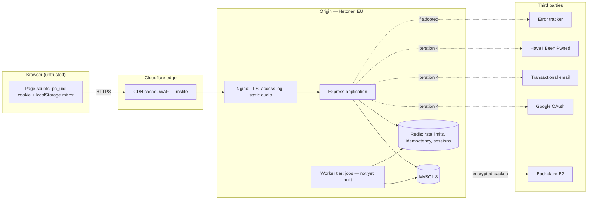

# PronounceAll — Threat Model (DRAFT v0.1)

**Status:** DRAFT for owner review, 2026-09-17. First version, scoped to the
architecture frozen in SRS 1.0.6, SDD v1.1 and the Round 1 Decisions, and to what is
built through Iteration 3. It is the Threat Model that NFR-PRIV-01, NFR-PRIV-06,
NFR-LEGAL-01 and FR-SAVE-10 require; later security work expands it rather than
replacing it.
**Not a redesign.** Every control named here is already specified. Where a control
is specified but not yet built, the status column says so.

**Status key:** **Built** — implemented and tested in the repository. **Specified** —
fixed by the SRS/SDD, scheduled for a later iteration. **Open** — a finding that needs
a decision.

---

## 1. Scope and trust boundaries

Trust boundaries: browser ↔ edge; edge ↔ origin; application ↔ data stores (least-
privilege principals, SDD §4.9); origin ↔ each third party.

## 2. Assets

| Asset | Where | Sensitivity |
|---|---|---|
| Anonymous identity `pa_uid` | Cookie, localStorage, `anonymous_profiles` | Pseudonymous; the key to a learner's history |
| Learning history: save/tag, listen and encounter events | `user_activity_events` | Personal data once linked to a person; reveals study behaviour |
| Derived save state | `user_word_states`, `user_phoneme_states` | As above |
| CSRF key `CSRF_SECRET` | Configuration | Secret — forging tokens for any identity |
| Word requests | `word_requests` | Low; carries `pa_uid` |
| Logs | Nginx access log, application log | IP address (access log only), request addresses including search terms |
| [Iteration 4] Accounts, credentials, sessions, tokens | `users`, `user_accounts`, Redis, `auth_tokens` | High |
| Catalogue and audio | MySQL, audio store | Public content; integrity matters |

## 3. Third-party personal-data flows (NFR-PRIV-06)

| Recipient | Data exchanged | When | Status |
|---|---|---|---|
| Cloudflare edge | IP address, request metadata, Turnstile token | Every request; word request form | Specified (edge not deployed) |
| Google OAuth | Email, subject identifier, profile picture URL | Login with Google | Specified — Iteration 4 |
| Have I Been Pwned | First five hex characters of a SHA-1 password hash (k-anonymity) | Password choice | Specified — Iteration 4 |
| Transactional email (Brevo, provisional) | Recipient email and token URL | Verification, reset, deletion emails | Specified — Iteration 4 |
| Backblaze B2 | Encrypted logical database backup | Scheduled backup | Specified |
| Error tracker (Sentry, EU data region; selected 2026-10-01) | Error type, scrubbed message and stack, a random per-request correlation id, error code, HTTP method and path without query; no request body, headers, cookies, IP, user or breadcrumbs (`src/lib/error-tracker.js`) | On a 5xx response, an unhandled error, or an exhausted background job | **Built** 2026-10-01. Proposed determination, for owner review: no personal data is transmitted (see F5) |

No other intentional personal-data flow leaves the origin. Encounter and listen
events never leave it.

## 4. Threats and controls

| # | Threat | Control | Status |
|---|---|---|---|
| T1 | **Cross-site request forgery** on a state-changing endpoint | Stateless HMAC token under `CSRF_SECRET` over `csrf:v1:anon:<pa_uid>`, issued only on uncached per-viewer responses, verified in constant time; same-origin `Origin` check, `Sec-Fetch-Site` fallback, neither refused (SDD §6.6) | Built for `/save`, `/listen`, `/request-word` (F1 closed) |
| T2 | **Per-viewer data in a shared cache** (a token, state or cookie served to another viewer) | Shells carry no token, state or `Set-Cookie`; per-viewer data only on `private, no-store` hydration and confirmation responses (B2) | Built, tested |
| T3 | **Cross-user data exposure** through hydration or writes | Owner resolved from the request's own `pa_uid` through `current_identity_bindings`; no client-supplied owner; hydration reads only that owner's rows | Built, tested |
| T4 | **Forged or arbitrary target ids** | `target_kind` enumerated; `target_id` validated as a positive integer and checked to exist in `words`/`phonemes` before any write | Built, tested |
| T5 | **Event flooding** / storage exhaustion | Save/tag bucket 60/min per `pa_uid` (Appendix C), edge limit 1000/min per IP; encounters one per actor, word and UTC day by database key | Built (rate limit and the V9 encounter key) |
| T6 | **Rate-limit evasion by discarding cookies** | A request without `pa_uid` has no identity a token was issued for, so writes fail CSRF; edge IP limit still applies | Built |
| T7 | **Duplicate or replayed writes** | Idempotency reservation, 30 s window, per identity; state machine makes repeats no-ops (FR-SAVE-08) | Built, tested |
| T8 | **Event-log tampering** | Runtime role holds INSERT/SELECT only on `user_activity_events` and `identity_bindings` (SDD §4.9); no application UPDATE/DELETE path | Built in code; **Specified** as database grants (F3) |
| T9 | **Derived-state drift** misrepresenting progress | Reconciliation recomputes from the log, dry run and repair (FR-SAVE-04) | Built, tested; schedule Specified (worker tier) |
| T10 | **Passive-visitor profiling** | Reads never create a profile (FR-AUTH-03); listen and encounter writes require an existing progress profile and never create one (FR-SAVE-09, FR-SAVE-10) | Built for listens and encounters, tested |
| T11 | **Free-text leakage into learning history** | Listen and encounter payloads accept only `targetKind` and `targetId`; no query, referrer or text field exists | Built for listens and encounters, tested |
| T12 | **Sensitive values in logs** | Central redaction of cookies, tokens, passwords and credentials (NFR-SEC-10); IP only in access logs; request bodies not logged | Built; application logs record the path without its query string, so search terms reach only the access logs (F2 closed) |
| T13 | **Open redirect** through the no-JS save flow | Return path restricted to a same-site relative path, otherwise `/` | Built, tested |
| T14 | **Injection** | Parameterised static SQL only, enforced by lint (NFR-SEC-07); output escaping in views | Built |
| T15 | **Script injection** | CSP without `unsafe-inline`; shells nonce-free `script-src 'self'` (amended NFR-SEC-03) | Built |
| T16 | **Microphone or device access** | `Permissions-Policy` denies at least camera, microphone, geolocation, payment, usb and interest-cohort (NFR-SEC headers) | Built — sent on every response; a browser test confirms Chromium refuses `getUserMedia` (F6 closed) |
| T17 | **Retention beyond purpose** | Dormancy prune of unbound anonymous identities after 2 years; account lifecycle for bound ones (NFR-PRIV-02) | Specified (worker tier) |
| T18 | **Incomplete erasure** | Ordered hard delete of all owner rows including bound anonymous identities' events, audit tombstone without PII (FR-SET-08, SDD §4.9) | Specified — Iteration 4/6 |
| T19 | **Account and session attacks** | ASVS L2 controls: bcrypt 12, HIBP, generic errors, session epoch, rotation, Turnstile, auth rate limits | Specified — Iteration 4 |
| T20 | **Secret compromise** (`CSRF_SECRET`) | Secret from environment only, never committed, ≥ 32 characters required in production; rotation invalidates outstanding tokens only | Built |

## 5. Endpoint entries

### 5.1 `GET /viewer-state` (hydration)

Read only; never writes, never creates a profile. Returns the requesting identity's
states, counts, `recordsHistory` and its CSRF token. `private, no-store`. Threats T2,
T3.

### 5.2 `POST /save` and `GET /save/confirm`

CSRF (T1), rate limit and idempotency (T5, T7), target validation (T4), owner
resolution (T3). The confirmation page is private, issues token and a CSPRNG
idempotency key, and restricts the return path (T13).

### 5.3 `POST /listen` (FR-SAVE-09)

CSRF (T1), save/tag bucket (T5), target validation (T4). Records only for an actor
with an existing profile; otherwise a successful no-op (T10). Payload is two
identifiers (T11). Never touches derived state. Not deduplicated by design; flooding
is bounded by the rate limit.

### 5.4 `POST /encounter` (FR-SAVE-10) — required before Slice 4 is enabled

**Built 2026-09-29** (V9, `encounter.service.js`), every control below covered by
`tests/integration/encounter-http.test.js` and `tests/e2e/word-encounter.spec.js`. The
body carries `wordId` and the FR-SAVE-08 idempotency key; any other field is dropped by
the validator. Not to be enabled in production until the FR-SAVE-10 release gate is
met (the Privacy Policy published with its owner facts).

| Threat | Required control |
|---|---|
| CSRF (T1) | Frozen §6.6 token and same-origin check |
| Forged target (T4) | `targetKind` fixed to `word`; `targetId` validated and checked to exist |
| Passive-visitor profiling (T10) | Records only for a registered user or an anonymous actor with an existing progress profile; never creates a profile; a no-op success otherwise; hydration's eligibility flag spares the request |
| Free-text leakage (T11) | The request accepts no query, referrer or text; the stored row is owner, `word_id`, null value, `occurred_at` |
| Flooding (T5) | Save/tag rate-limit bucket; one event per owner, word and UTC day enforced by a unique key on a generated column, duplicate key treated as success; no update or delete |
| Cross-user exposure (T3) | Owner resolved from the request's own identity |
| Tampering and drift (T8, T9) | Append-only; excluded from derived state and from reconciliation |
| Erasure (T18) | Ordinary event-log rows: dormancy prune and hard delete remove them |
| Logs (T12) | Only the request address `/encounter` is logged, never the body |
| Cached shell (T2) | Sent by the page script after hydration; the shell and the hydration read never write |

### 5.5 `POST /request-word`

Turnstile and a 10/hour limit per `pa_uid` (FR-WORD-05). CSRF-verified under §6.6: the token is carried by the form on the uncached word-not-found page (F1 closed).

## 6. GDPR crosswalk (NFR-LEGAL-01)

| Article | Implemented by |
|---|---|
| 5 — principles | NFR-PRIV-01 minimisation; NFR-PRIV-02 retention; FR-AUTH-03 no profile on read; FR-SAVE-09/10 eligibility boundary; this model's controls for integrity and confidentiality |
| 6 — legal basis | Privacy Policy §4 (proposed, pending legal review) |
| 7 — consent | FR-CONSENT-03/04 consent records for opt-ins; no consent-based processing in Iteration 3 |
| 12 — response times | NFR-PRIV-04 (acknowledge 3 business days, fulfil 30 days, extension 60) |
| 13 — information | Privacy Policy and KVKK notice (FR-CONSENT-05), drafts pending review |
| 15 — access | NFR-PRIV-04 DSAR procedure in the Runbook |
| 17 — erasure | FR-SET-07/08, NFR-PRIV-03 |
| 20 — portability | NFR-PRIV-04 export, scoped to what v1.0 stores |

## 7. Open findings

| # | Finding | Proposed handling |
|---|---|---|
| F1 | `POST /request-word` has no CSRF token, contrary to FR-AUTH-20. It predates the §6.6 scheme. Impact is low (Turnstile and a rate limit guard it; a forged request adds or up-votes a word request). | **Closed 2026-09-29.** Under §6.6; refused without a valid token, tested |
| F2 | Request logging records full URLs, so search terms (`/search?q=…`) reach application and access logs for every visitor, unlinked to a profile. | **Closed 2026-09-29.** Owner chose stripping: application logs record the path only; the Privacy Policy §3.4 says so |
| F3 | The least-privilege database principals of SDD §4.9 are not provisioned; development uses one application user. The append-only rule is enforced by code and tests, not yet by grants. | **Built 2026-10-01.** `npm run db:provision` creates the six principals of §4.9 (amended 2026-10-01: `pa_seed`'s two catalogue deletes, the new `pa_backup`, `pa_migrate`'s measured migration set) and converges on rerun. An integration test proves FR-SAVE-03 at the grant level (`pa_app` cannot update or delete history or bindings) and runs the real web flows as `pa_app`, the erasure jobs as `pa_erase` and the token prune as `pa_maint`; a backup and restore test ran as `pa_backup`. Remaining: provision on the production server, in the documented order |
| F4 | The worker tier is not built: dormancy prune, hard delete, scheduled reconciliation. | Build with deployment and Iteration 4/6 |
| F5 | Error tracker not selected; NFR-PRIV-06 residual-data determination outstanding. | **Built 2026-10-01; determination proposed, for owner review.** Sentry, EU data region (maintainer decision 2026-10-01). The SDK runs with no default integrations and no tracing, so it collects nothing on its own; a report carries only the error type, its message and stack with emails, token-shaped strings and IP addresses masked, a random correlation id, the error code, the HTTP method and the path without query string. No IP address, user, cookie, header, body or breadcrumb is sent; an integration test asserts this on the captured envelope. Proposed determination: no personal data reaches the tracker; the correlation id is random per request and re-identifies nothing outside the origin's own logs. Sentry still sees the origin server's own IP as a client. Owner/legal decide whether to list Sentry as a recipient in the Privacy Policy anyway (its §6 row is still marked [OWNER]) |
| F6 | The `Permissions-Policy` header required by the NFR-SEC response-header requirement is not sent (verified on a live response 2026-09-17; the other required headers are present). Nothing in the product requests a device today, so exposure is low. | **Closed 2026-09-29.** Sent from the security-headers middleware; integration and browser tests |
| F7 | Email-verification and password-reset links carry their single-use token in the query string (`/verify-email?token=…`, `/reset-password/confirm?token=…`), and the Google callback carries the authorization code and OAuth state (`/auth/google/callback?code=…&state=…`). Application logs record the path only (F2) and the token pages send `Referrer-Policy: strict-origin`, but a proxy or edge access log that records full URLs would store usable tokens, contrary to NFR-SEC-10. Tokens are single-use and expire in 24 h / 1 h. | Configure the Nginx (and any edge) access-log format to drop the query string, at least for those three paths, with deployment. Accepted by the owner 2026-09-30 as a deployment requirement |
